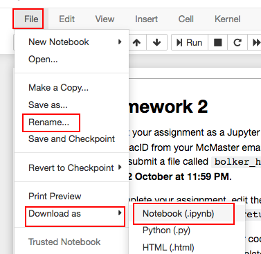
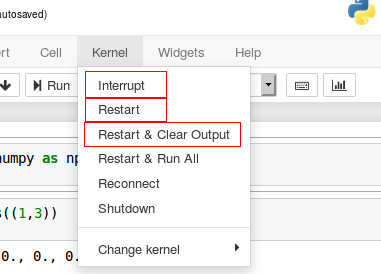

## Week 8

* homework 4: Codelab questions. These are due on Weds Nov 6 at 11:59 PM.
    - Sets:
        - Initialization/creation: 51804
        - Addition/removal: 51805  51810
        - Iteration: 51301
    - Dictionaries: 
        - Adding/removal: 51818  51819  51302
        -  Traversal:  51828  51826  51281
    - Files:  51356  51361

## midterm 1

- midterm 1 will be held from 7-8 PM on 22 October (Tues). If your family name begins with the letters A-S, please go to Canadian Martyrs (across Main Street from the hospital) to take the test. If your family name begins with the letters T-Z, please go to BSB B135.
   - no calculators or other test aids will be allowed (why would you need them anyway?)
   - Canadian Martyrs is located at 1355 Main Street West across the street from the Information Technology Building (ITB). Students writing exams should enter the building by the Main Street entrance using the cement pathway. Please do not enter using the school front entrance or the side/playground entrances.
   
## Week 6

- Homework: **don't forget**
   - delete `raise NotImplementedError()` from your notebook before submitting!
   - submit your homework as `yourmacid_hw3.ipynb`
   - Instead of using Avenue, you are encouraged to submit your homework to https://macdrive.mcmaster.ca/u/d/7985d0ce553e467e998a/ instead; please upload exactly one file. If your homework is in the proper format, you will receive an automatic e-mail within an hour. All assignments not in the proper format are automatically deleted. **If you do not receive an email, your assignment was in the wrong format; fix any problems and resubmit.** If there is an issue with the link please contact `pocucan@mcmaster.ca`.
- The lectures this Thursday (10 Oct: Bolker) and Friday (11 Oct: Pang) will be **review sessions** for the test on 22 October. We will be doing a brief overview of the course outline, but will primarily be focusing on questions from students, so please plan to ask questions!
- The test will cover everything up to and including the "week 5" notes (**not** covering Newton's method, not covering file I/O). Please see the previous years' midterms posted on the course web page for examples of typical questions.
   
## Week 5

- Homework #3 is now posted [here](../assignments/math1mp_hw3.ipynb). It is a self-contained Jupyter notebook that includes all of the instructions. Please read these and submit your homework to Avenue to Learn before **11:59 PM on Fri 11 Oct**.

## Week 4

- don't forget to remove the `raise NotImplementedError()` from your homework notebook before submitting!
- more details on homework submission:
    - download the homework template from [here](http://bbolker.github.io/math1mp/assignments/math1mp_hw2.ipynb)
	- if you're working on syzygy, click the "Upload" button (upper right hand of screen) to copy the file from your computer to the syzygy server
	- fill in your solutions
	- rename the file to `yourmacid_hw2.ipynb` (where "yourmacid" is your actual MacID, the same as the beginning of your McMaster email address)
	- download the notebook as a `.ipynb` file: 
    
	- upload the file to Avenue to Learn: Avenue > Math 1MP3 > Assignments > HW2
- more on the `[*]` in syzygy:	
    - This means that *something* earlier in your session got stuck. There's probably nothing wrong with your code. In order, try these solutions:
	  - `Kernel > Interrupt` 
	  - `Kernel > Restart`
	  - `Kernel > Restart & Clear Output` 
         
    - Next, try stopping and restarting your server: go to the Control Panel (see below), click the Red "Stop My Server" button, then click the blue "Start My Server" button.
    - Some students have been stuck even after trying all of these. Waiting a while and then logging back in might help. Do please e-mail and let me know which (if any) of these works!
    - The bottom line, though, is that (1) it's not your fault if stuff gets stuck and (2) if you can run your code somewhere else (with Anaconda/jupyter notebooks on your own computer, in Python Tutor, on Repl.it, etc.) it should be fine.	

## Week 3

- **QUIZZES ARE POSTPONED UNTIL NEXT WEEK** due to technical difficulties.
- Homework #2 is now posted [here](../assignments/math1mp_hw2.ipynb). It is a self-contained Jupyter notebook that includes all of the instructions. Please read these and submit your homework to Avenue to Learn before **11:59 PM on Weds 2 Oct**.
- there will be quizzes in your lab sessions next week. These will be CodeLab questions covering the material in weeks 1 and 2 (i.e., everything in the notes for these two weeks - not including functions or any material after that). The quizzes will start 10 minutes after the beginning of the class period; you'll have 15 minutes (and 5 tries per question) to answer.

## Week 2

- Dr. Bolker's office hours (HH 314): Tues 1:30-2:20 AM, Thurs 10:30-11:20 AM. (**this week only**, 12 Sep, Thurs office hours will be 11:45-12:20 instead).
- Dr. Pang's office hours (HH 414): 3:30 - 4:30pm Weds, 12-1pm Fri

## Week 1

- We've set up a Facebook forum for the class at: https://www.facebook.com/groups/406619356725041/ . This forum is available for any course-related questions. Questions about homework are OK, but no spoilers please! Please be polite.
- Student Accessibility Services is looking for a note taker for section C01 (Dr Bolker's section). This is a **volunteer** position. You can get a letter of reference from SAS saying you've done it. It does help motivate you to come to class and take good notes! And you'll be helping someone. If you're interested, please go to https://sas.mcmaster.ca/volunteer-notetaking/ for registration and program instructions, or write to `sasnotes@mcmaster.ca` for more information.

## Week 0

- You should figure out how to start Python (online or on your computer: instructions [here](../notes/use_python.html)) and register for CodeLab (instructions [here](./notes/use_python.html#codelab)) as soon as possible.
- Read the [course outline](./outline.html).
- Tutorials will start on Mon 9 September.
- Classes will be held in TSH B105
    - the first class for section C01 is Tues 3 Sep 4:30
    - the first class for section C02 is Weds 4 Sep 2:30
- Information on HW#1: this can be found on CodeLab, in the table of contents under "Python3 Topics > Assignment #1". It is due before 23:59 on Monday September 16. Please be sure to submit your solutions to these 16 questions before then.  You can get practice with similar questions in the relevant CodeLab subsections (Arithmetic; Strings (I) and (II); Conditions and Branches). All the material you need for these questions is in the Week-1 notes, and will be covered by the end of class next Monday (Sep 9).

