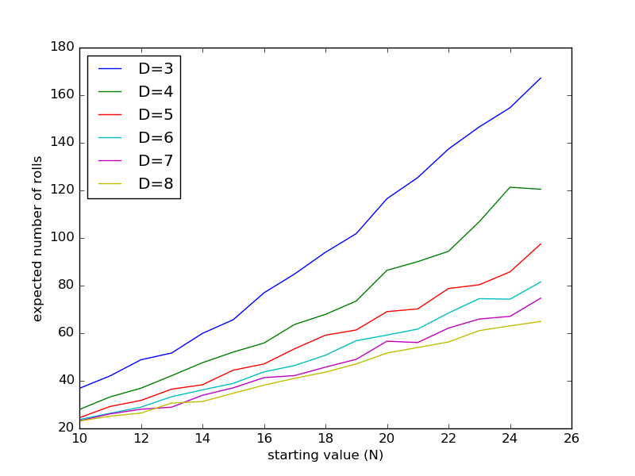
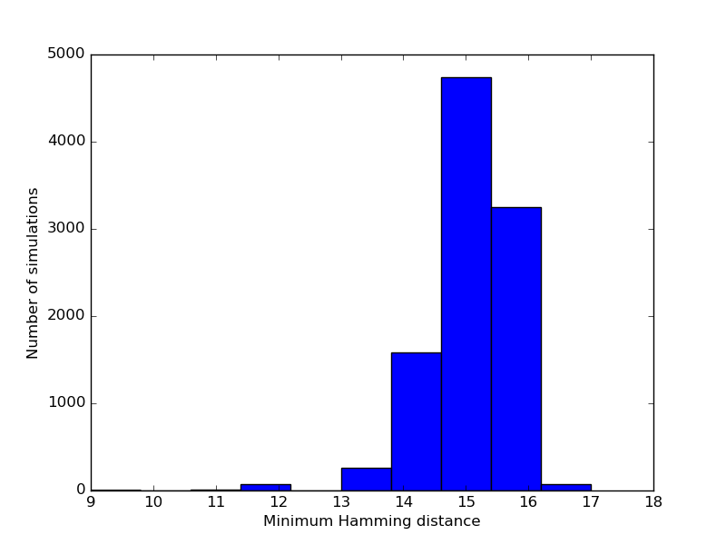

```{r opts,message=FALSE,echo=FALSE,warning=FALSE}
library("knitr")
opts_chunk$set(tidy=FALSE,engine='python',engine.path='python3')
```

These projects are **individual** projects; if you discuss anything about them with other students in the class, you should follow the standard rules (don't write anything down while you are engaged with the other students).  If you get anything from the web, give references.

Choose **one** of the two projects below. If you have your own idea for a different project, please send me an e-mail with a 1-paragraph description *before Fri 17 March*; I will review it and let you know if it's suitable.

Depending on which project you pick, submit your code in the Dropbox as `macid_proj_wipeaway.py` and your plot as `macid_proj_wipeaway.png`, or your code as `macid_proj_cipher.py` and your project as `macid_proj_cipher.png`.

We do **not** want to have to run your simulation and plotting code when we import your Python file. Include it in your Python file in **one** of the following ways:

- commented out
- within an `if False:` block
- within an `if __name__ == "__main__":` block

For example,

```{r ex,eval=FALSE}
import numpy as np
import numpy.random as npr
import matplotlib.pyplot as plt

def run_sim(N=20,D=6,p=0.5,itmax=5000):
    """run wipeaway simulation"""
##    ...
    return(it)

## ... more function definitions ...

def plot_results(N_vals,D_vals,a)
##    ...

if __name__ == "__main__":
    a = many_sims((10,25),(3,8),nsim=1000)
    D_vals = np.arange(3,9)
    plot_results(N_vals,D_vals,a)
    plt.savefig("manysims.png")
```

To test this, if you open a Python console and run `from my_proj import *` (with the name of your code substituted for `my_proj`, nothing should happen; it shouldn't take long to run (because you are only defining the functions, not running them), nothing should be printed, and no plots should be produced.

### Wipeaway (dice game)

Consider the following stochastic process:

- set a counter to a starting value (`N`: let the default value be 20)
- at each turn:
    - roll a die with `D` sides: suppose the result is `c`
	- flip a coin: if it's heads (with probability $p$), try to add `c` to the counter, otherwise (with probability $1-p$) try to subtract `c` from the counter
	- if the result of adding or subtracting `c` would be $>N$ or $<0$, ignore the roll and try again (but do increment the counter)
	- if the result of subtracting `c` would be exactly zero, stop: you've won the game

1. Write a function `run_sim(N=20,D=6,p=0.5,itmax=5000)` that runs a single simulation with the specified parameters and returns an integer giving the number of steps it took to reach zero. You can assume that `N` and `D` are non-zero integers, and `p` is a float between 0 and 1. If the count goes above `itmax` your function should raise a `RuntimeError`.

2. Write a function `collect_sims(nsim,N,D,p=0.5,nmax=10000)` that runs your `run_sim` function `nsim` times (with parameters `N`, `D`, `p`) and returns a numpy array of length `nmax` giving the number of times that the simulation took a specified number of steps to stop. For example, suppose `nsim` was 8 and successive runs of `run_sim` gave you 3,4,4,3,6,5,4,4. You would tabulate this as "two 3s, four 4s, one 5, one 6, zero 7s, zero 8s ... "
```{r echo=FALSE}
import pandas as pd
print(pd.DataFrame(data=[0,0,0,2,4,1,1,0,0],
                   index=list(range(9))))
```

3. Write a function `exp_val(a)` that takes an array and computes the expected value from it: the expected value is defined as $\sum_{i=0}^{n-1} (i a_i)/N$, where $n$ is the length of the array and $N$ is the number of simulations (also equal to $\sum_i a_i$).

4. Write a function `many_sims(N_vals,D_vals,p=0.5,nsim=100)`: `N_vals` and `D_vals` are 2-element tuples. The function should run your simulation `nsim` times for each combination of `N` values between `N_vals[0]` and `N_vals[1]` **inclusive** and `D` values between `D_vals[0]` and `D_vals[1]` **inclusive**  and return a 2-dimensional `numpy` array with `N_vals[1]-N_vals[0]+1` rows and `D_vals[1]-D_vals[0]+1` columns. For each parameter set it should put the expected value of the number of rolls (i.e., by using `collect_sims` and `exp_val` in the corresponding cell of the array, with rows corresponding to `N` values and columns corresponding to `D` values. For example, if `N_vals` is `(19,20)` and `D_vals` is `(5,5)`, the results from `many_sims((19,20),(5,5))` might be:
```{r echo=FALSE}
from my_project import *
npr.seed(101)
print(many_sims((19,20),(5,5)))
```

5. Write a function `plot_results(N_vals,D_vals,a)` (where `N_vals` and `D_vals` are as described above, and `a` is the result of running `many_sims` that makes a single plot with values of `N` on the x-axis, the expected values on the y-axis, and a separate line (or point colour or something) for each value of `D`

The plot below is the result of running these commands:

```{r eval=FALSE}
a = many_sims((10,25),(3,8),nsim=1000)
N_vals = np.arange(10,26)
D_vals = np.arange(3,9)
plot_results(N_vals,D_vals,a)
```

but if this takes too long you can use a smaller set of `N_vals` (use at least 5 distinct values) and/or `D_vals` (use at least 2 distinct values), or a smaller `nsim` (at least 100).



### Substitution ciphers

A *substitution cipher* is the simplest way of encrypting a message. It is constructed by defining a permutation on the letters of the alphabet, and substituting accordingly. For example, suppose we had the following permutation:
```
abcdefghijklmnopqrstuvwxyz
gikaclmnqrpoxzybdefhjstuvw
```
Then the message `"hello"` would translate to `"ncooy"`, and `"goodbye"` would translate to `"myyaivc"`.

For the purposes of this project, assume that all messages are entirely composed of lower case letters and spaces; spaces should be translated exactly is.  For example, using the previously defined cipher we would translate `"hello goodbye"` as `"ncooy myyaivc"`.

1. Write a function `sub_cipher(msg,d)` that takes a message string `msg` and a dictionary `d` where the keys are letters to translate *from* and the values are the letters to translate *to*, and returns a translated copy of the message.

2. Write a function `reverse_dict(d)` that switches the identities of the values and keys of a dictionary. Convince yourself that the code

```{r sub_cipher,eval=FALSE}
trans = sub_cipher(msg,d)
orig = sub_cipher(trans,reverse_dict(d))
orig == msg
```
always returns `True` (computer programmers sometimes call this kind of test [round-tripping](http://www.yourdictionary.com/round-tripping)).

3. Write a function `read_cipherdef(fn)` that opens a file (specified by filename `fn`) containing two lines, the first with the string giving the keys and the second with the string giving the values (as in the example above), and returns a dictionary.

4. A *crib* is a string that is known to be part of the original plaintext (i.e., the message that was translated). The *Hamming distance* between two (equal-length) strings is the number of mismatches between them (for example, the Hamming distance between `hello` and `iejlo` is 2). Write a function `min_crib_dist(crib,msg)`, where `crib` and `msg` are two strings (with `len(crib) <= len(msg)`), that returns the *minimum* Hamming distance between the crib and any substring of `msg`. In other words, your function needs to test all consecutive substrings of length `len(crib)` in the message and find the minimum Hamming distance.  For example `min_crib_dist("hello","this message almost contains hellx")` should return 1 because the string `"hellx"` has a Hamming distance of 1 from `"hello"`.

5. Write a function `rand_dict(keys=ascii_lowercase)` (`ascii_lowercase` is a constant from the `string` module; your code should include `from string import ascii_lowercase` that returns a dictionary with the letters of `keys` as keys and a permutation of the letters of `keys` as values. You can use `np.array(list(keys))` to create an array that contains the letters of `keys`, and the `shuffle` function from `numpy.random` to shuffle an array in place.

6. Write code that reads the contents of the test file `test1T.txt` as a variable `t1T` and records the minimum Hamming distance between the crib `"squeamish ossifrage"` and the translation of `t1T` with a random dictionary (i.e. `min_crib_dist("squeamish ossifrage",sub_cipher(t1T,rand_dict()))`) for 10,000 random dictionaries. Use `matplotlib.pyplot.hist` to draw a histogram of the results, like this:


