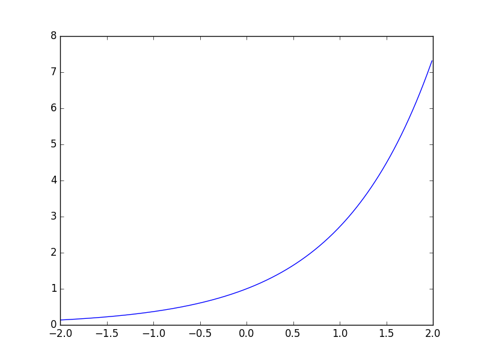
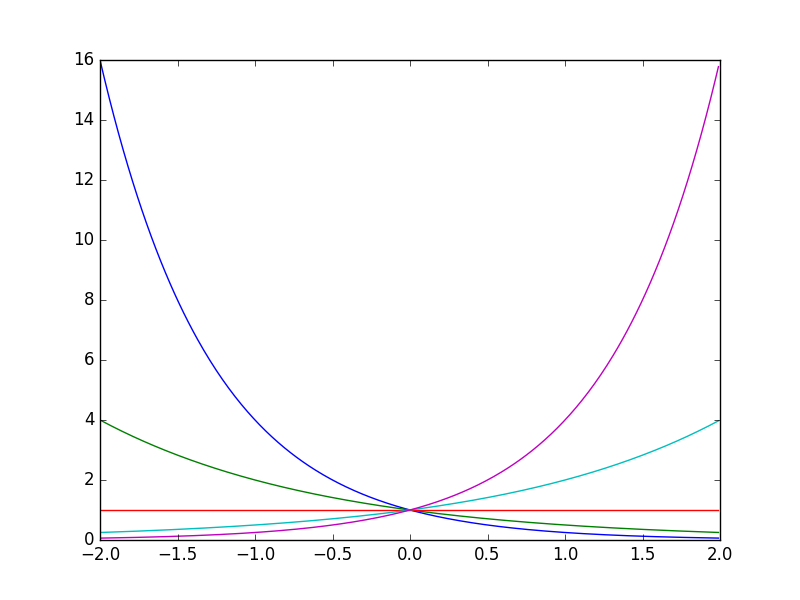
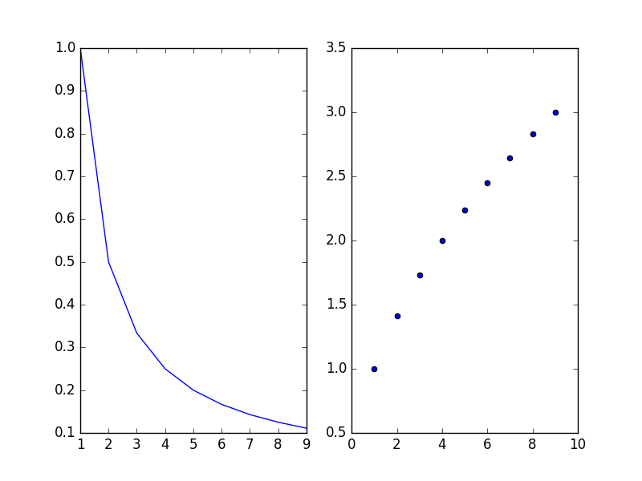

```{r, echo = FALSE, warning = FALSE}
library("knitr")
opts_chunk$set(tidy = FALSE, engine = 'python',engine.path = 'python3')
```

[Python documentation reference](https://docs.python.org/3/tutorial).

***

# PRE-MIDTERM

This section is a duplicate of the [Midterm Review](midterm_review.html), repeated here for easy access.

***

## Strings

Arrays of characters, can be used to hold single characters, words, sentences, user input/output, etc. Strings are declared using single or double quotes.

```{r}
c   = "a"
wd  = "moxie"
sen = "Your midterm is on Friday!"
print(c)
print(wd)
print(sen)
```

They can be easily concatenated or repeated.

```{r}
print("hi" + "there")
print(3*"blah")
```

#### Building Strings

You can 'build' strings by creating an empty string and adding to it

```{r}
s = ""
s += "What's"
s += " "
s += "up?"
print(s)
```

***

## Lists

Lists are used to store arrays of any type. They can all be the same type (for example `int`), or differing types. They can also be added together like strings.

```{r}
numlist  = [1, 2, 3, 4, 5, 525600]
wordlist = ['this', 'is', 'a', 'list', 'of', 'words']
print(numlist)
print(wordlist)
print(numlist + wordlist)
```

#### Nested Lists

Lists can be nested too (lists in lists).

```{r}
nestlist = [[1,2,3],[4,5,6],[]]
print(nestlist)
```

Useful methods for working with lists include `append()` for adding a **single** element to the end of a list, *no matter what type it is*.

```{r}
numlist = [1, 2, 3]
print(numlist)
numlist.append(4)
print(numlist)
numlist.append([5])
print(numlist)
```

An alternative method, `extend()`, can be used to concatenate lists similar to using the plus (`+`) operator. Note that `extend()` expects its argument to be a list.

```{r}
numlist = [1, 2, 3]
print(numlist)
numlist.extend([4])
print(numlist)
numlist.extend([5, 6, 7])
print(numlist)
```

#### Note on Mutability

If you assign a list variable to another variable, both variables will point **at the same list**.

```{r}
L1 = [1, 2, 3, 4, 5]
L2 = L1
L2.append(55)
print(L1)
print(L2)
```

#### Useful methods for Lists

Some other helpful methods for working with lists (from class notes):

* `x.remove(value)`: removes *first* value
* `x.reverse()` (or `x[::-1]`)
* `x.index(value)`: first occurrence of `value`
* `len(x)`: length

***

## Tuples

Similar to lists, but are **immutable** (more on that later).

```{r}
tup = (1, 2, 3, (4, 5))
print(tup)
```

***

## Indexing and Slicing

Strings, lists, and tuples all support indexing and slicing. This means we can access individual elements or ranges of elements in any of these types. Recall that element **indices start at 0**.

```{r}
nums = [1,2,3,4,5]
s = "Pythons are snakes"
print(nums[0])		# indexing
print(nums[1:4])	# slicing
print(s[-1]) 		# indexing from end
print(s[-3:])		# slicing to end
```

With nested lists/tuples, double indexing is used.

```{r}
tup = ((1,2,3),(4,5))
print(tup[0])
print(tup[0][1])
print(tup[-1][-1])
```

With lists you can assign *to* elements using indexing/slicing, this **does not** work with strings/tuples as they are **immutable**.

```{r}
numlist = [[1, 2, 3], [], [4, 5]]
print(numlist)
numlist[0][2] = 42
print(numlist)
```

***

## If statements

If statements can be used to conditionally execute code. We usually check conditions using logical operators such as

* `==` equal to
* `!=` not equal to
* `<` less than
* `<=` less than or equal to
* `>` greater than
* `>=` greater than or equal to

For example:

```{r}
x = 5
if x < 17:
	print("x is smaller")
```

Alternative conditions can be checked at the same time using `elif` statements, and a default action can be set using `else`.

```{r}
x = 42
if x < 17:
	print("x is smaller")
elif x > 17:
	print("x is bigger")
else:
	print("x is the same")
```

***

## Loops

We can repeatedly carry out sequences of instructions using `for` or `while` loops. Traditionally, `for` loops are used when we know how long the loop needs to run for, and `while` loops are used when we do not ro would rather have the computer figure it out.

```{r}
for i in range(10):
	print(i)
```

```{r}
i = 0
while i**2 < 87:
	print(i)
	i += 2
```


## Functions

We can define functions to store sections of code we want to run repeatedly. The input/output is specified using arguments and return statements

```{r}
def add1(x):
	x += 1
	return(x)

x = 3
print(add1(x))
print(x)
```

Note that `x` is not modified in the above example because it is **immutable**. Immutable types are numbers (`int`/`float`), strings, and tuples. Imporatant: **lists are mutable**.

```{r}
def append4(list):
	list.append(4)
	return(list)

numlist = [1,2,3]
print(append4(numlist))
print(numlist)
```

***

# POST-MIDTERM

Everything that follows covers material since the midterm.

***

## Dictionaries

Stores unordered key-value pair data.

```{r}
dict = {"a":1, "b":2, "c":3}
print(dict)
```

You can extract iterables over the keys or values. Recall that they are **unordered**.

```{r}
dict = {"a":1, "b":2, "c":3}
print(dict.keys())
print(dict.values())
```

Value insertion / deletion is done using the keys.

```{r}
dict = {"a":1, "b":2, "c":3}
print(dict)

x = dict["b"]	## accessing
print(x)

dict["d"] = 42	## insertion
print(dict)

del dict["a"]	## deletion
dict["b"] = 17	## modification
print(dict)
```


***

## Numpy

Gives access to convenient data structure and function for working with arrays and matrices.

Performs element-wise operation by default.

```{r}
import numpy as np

a = np.arange(5)
b = np.arange(5,10)

print("a:  ", a)
print("b:  ", b)
print("a+b:", a+b ) 	# element-wise addition
print("a*b:", a*b )		# element-wise multiplication
print("2^a:", 2**a)		# scalar expansion - powers
```

Arrays can be reshaped as long as the number of elements does not change.

```{r}
import numpy as np

a = np.arange(9).reshape(3,3)
print(a)
```

Slicing works Numpy arrays works using a compact `[i,j,...]` notation, with the `:` used as a place-holder to indicate we want to access all elements in that dimension.

```{r}
import numpy as np

a = np.arange(9).reshape(3,3)

print(a, end = "\n\n")			## print entire matrix
print(a[1,2], end = "\n\n") 	## print element in second row, third column
print(a[1,:], end = "\n\n")		## print second row
print(a[:,-1], end = "\n\n")	## print last column
```

We can perform matrix multiplication using the `dot` function.

```{r}
import numpy as np

a = np.random.rand(9).reshape(3,3)		## matrix with random elements
b = np.linalg.inv(a)					## take the inverse
c = np.dot(a,b)							## matrix multiplication

print(c)
```

***

## Plotting

Plotting in Python can be done with `matplotlib`.

```{r}
import matplotlib.pyplot as plt
import numpy as np

a = np.arange(-2, 2, 0.01)

plt.plot(a, np.exp(a)) 				## plot the exponential function
plt.savefig("exrevpix/plot1.png")	## save figure
```




Rows of a matrix can be plotted automatically.

```{r}
import matplotlib.pyplot as plt
import numpy as np

## plot exponential family with different bases
x = np.arange(-2, 2, 0.01)
b = np.array([1/4, 1/2, 1, 2, 4]).repeat(x.shape[0]).reshape(5, x.shape[0])

y = np.transpose(b**x)

plt.plot(x, y)
plt.savefig("exrevpix/plot2.png")	## save figure
```



We can use subplots to plot within the same figure. Note that the subplot index (third argument) must be changed in order to change which subplot we are plotting to.

```{r}
import matplotlib.pyplot as plt
import numpy as np

x = np.arange(1, 10, 1)

plt.subplot(1, 2, 1)
plt.plot(x, 1/x)

plt.subplot(1, 2, 2)
plt.scatter(x, np.sqrt(x))

plt.savefig("exrevpix/plot3.png")
```



***

## File I/O

Reading from files is done by opening the file and using one of the read functions (`read`, `next`, `readline`, `readlines`).

For example, a file `dune.txt` containing

```
In the week before their departure to Arrakis
when all the final scurrying about had reached a nearly unbearable frenzy
an old crone came to visit the mother of the boy
Paul
```

can be read and split into a list of words using:

```{r}
filename = "dune.txt"
f = open(filename)

wordlist = f.read().split()
print(wordlist)
```

Similarly we could read a list of numbers and insert them into a Numpy array. Given the file `nums.txt` containing:

```
0 1 2 3 4 5 6 7 8 9
```

we can process it using:

```{r}
import numpy as np

filename = "nums.txt"
f = open(filename)

numlist = f.read().split()
a = np.array(numlist, dtype = int)
print(a)
```

***


*Keep an eye on this page, more may follow...*