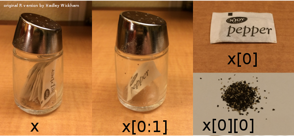

<!-- to include in week 2 notes -->

# Lists and indexing (PP chapter 8)

*reference*: [Python intro](https://docs.python.org/3/tutorial/introduction.html) section 3.1.3

## Lists

- Use square brackets `[]` to set up a **list**
- Lists can contain anything but usually homogeneous
- Put other variables into lists
- `range()` makes a **range** but you can turn it into a list with `list()`
     - *Set up a list that runs from 101 to 200*
- Indexing and slicing lists works almost the same way as indexing and slicing ...
- Put lists into lists! ("yo dawg ...")
     - difference between an *item from a list* (indexing, `x[0]`) and a *one-element list* (slicing, `x[0:1]`)

---



## Other list operations

- Lots of things you can do with lists!
- Lists are **mutable**
```{python list_mut}
x = [1,2,3]
y = x
y[2] = 17
print(x)
```

Check it out at [Python Tutor](http://pythontutor.com/visualize.html#mode=edit)

- *operators* vs. *functions* vs. *methods* `x+y` vs. `foo(x,y)` vs. `x.foo(y)`
    * list [*methods*](http://www.linuxtopia.org/online_books/programming_books/python_programming/python_ch14s07.html)
    * appending and extending:
```{python append}
x = [1,2,3]
y = [4,5]
x.append(y)
print(x)
```
```{python extend}
x = [1,2,3] # reset x
y = [4,5]
x.extend(y)
print(x)
```
Can use `+` and `+=` as shortcut for extending:
```{python operate}
x = [1,2,3]
y = [4,5]
z = x+y
print(z)
```

- `x.insert(position,value)`: inserts (or `x=x[0:position]+[value]+x[position+1:len(x)]`)
- `x.remove(value)`: removes *first* value
- `x.pop(position)` (or `del x[position]` or `x=x[0:position]+x[position+1:len(x)]`)
- `x.reverse()` (or `x[::-1]`)
- `x.sort()`: what it says
- `x.count(value)`: number of occurrences of `value`
- `x.index(value)`: first occurrence of `value` 
- `value in x`: does `value` occur in `x`? (or `logical(x.count(value)==0)`)
- `len(x)`: length

**Note**: [pythonicity](http://blog.startifact.com/posts/older/what-is-pythonic.html) vs. [TMTOWTDI](http://en.wikipedia.org/wiki/There%27s_more_than_one_way_to_do_it)
