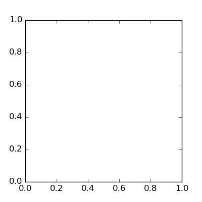
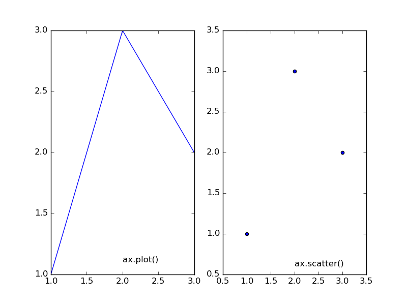
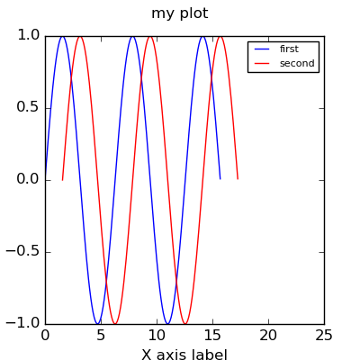

```{r opts,message=FALSE,echo=FALSE,warning=FALSE}
library("knitr")
opts_chunk$set(tidy=FALSE,engine="python",engine.path='python3')
```

* [matplotlib cheat sheet](https://bit.ly/python_cs)
* [matplotlib gallery](http://matplotlib.org/gallery.html)

### Basic setup

* create a figure: `fig=plt.figure()`
   * can include figure size `figsize=(w,h)`, background/edge color, resolution (dpi=dots per inch)
   * add a *subplot* (or "axes"): `ax = fig.add_subplot(1,1,1)` (rows,columns,which plot)
* now can show or save the figure: `fig.show()` or `fig.savefig("filename")`
* your operating system probably knows what to do if you click on the saved figure (or you can stick it in a Word document, etc.)

```{r echo=FALSE}
import matplotlib.pyplot as plt
fig = plt.figure(figsize=(4,4))
ax = fig.add_subplot(1,1,1)
fig.savefig("pix/empty.png")
```


### Basic plots

Basic things we can put on the plot: lines, scatter plots

```{r echo=FALSE}
import numpy as np
import matplotlib.pyplot as plt
fig = plt.figure(figsize=(7,4))
ax1 = fig.add_subplot(1,2,1)
ax2 = fig.add_subplot(1,2,2)
x = np.array([1,2,3])
y = np.array([1,3,2])
ax1.plot(x,y)
ax1.text(2,1.1,"fig.plot()")
ax2.scatter(x,y)
ax2.text(2,0.6,"fig.scatter()")
fig.savefig("pix/basic.png")
```


### Putting more than one thing on a plot

* You can do more than one `plot()` or `scatter()` on the same set of axes 
```{r echo=FALSE}
import numpy as np
import matplotlib.pyplot as plt
fig = plt.figure(figsize=(4,4))
ax1 = fig.add_subplot(1,1,1)
x = np.arange(0,5*np.pi,0.1)
y = np.sin(x)
ax1.plot(x,y)
ax1.plot(x+np.pi/2,y,color="red")
fig.savefig("pix/basic2.png")
```


Distinguish lines: 
* `color`
* `marker` (`+`, `o`, `x`, ...)
* `linewidth`
* `linestyle` (`-`, `--`, `-.`, `None`, ...)

## Decorating plots 

* titles (`ax.set_xlabel()`, `ax.set_ylabel()`)
* change limits
* title: `fig.suptitle()` (refers to figure, not individual axes)
* legend: need to label plotted stuff. e.g.
```{r eval=FALSE}
ax1.plot(x,y,label="first")
ax1.plot(x+np.pi/2,y,color="red",label="second")
ax1.set_xlim([0,25])
ax1.legend(fontsize=8)
fig.suptitle("my plot")
```

```{r echo=FALSE}
import numpy as np
import matplotlib.pyplot as plt
fig = plt.figure(figsize=(4,4))
ax1 = fig.add_subplot(1,1,1)
x = np.arange(0,5*np.pi,0.1)
y = np.sin(x)
ax1.plot(x,y,label="first")
ax1.plot(x+np.pi/2,y,color="red",label="second")
ax1.set_xlabel("X axis label")
ax1.set_ylabel("Y axis label")
ax1.set_xlim([0,25])
ax1.legend(fontsize=8)
fig.suptitle("my plot")
fig.savefig("pix/basic3.png")
```


* [Lorenz attractor example](http://matplotlib.org/examples/mplot3d/lorenz_attractor.html)

```{r}
import odesolve
import numpy as np
import matplotlib.pyplot as plt
from mpl_toolkits.mplot3d import Axes3D

def lorenz(time, state, params):
    x, y, z = tuple(state)
    s, r, b = params
    x_dot = s*(y - x)
    y_dot = r*x - y - x*z
    z_dot = x*y - b*z
    return((x_dot, y_dot, z_dot))

tvec = np.arange(0,200,0.01)
lfit = odesolve.solveODE3(lorenz,(0.,1.,1.05),tvec,(10,28,2.667))
fig = plt.figure()
ax = fig.gca(projection='3d')

ax.plot(lfit[:,0], lfit[:,1], lfit[:,2])
ax.set_xlabel("X Axis")
ax.set_ylabel("Y Axis")
ax.set_zlabel("Z Axis")
ax.set_title("Lorenz Attractor")

fig.savefig("pix/lorenz.png")
```

