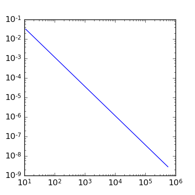
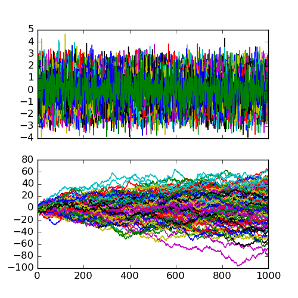
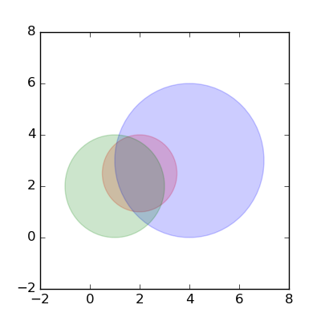
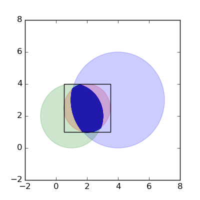

```{r opts,message=FALSE,echo=FALSE,warning=FALSE}
library("knitr")
opts_chunk$set(tidy=FALSE,engine="python",engine.path='python3')
```


## Numerical integration

- How should we integrate $\int_0^1 \sqrt{1-x^2} \, dx$?
```{r echo=FALSE,warning=FALSE,results="hide"}
import matplotlib.pyplot as plt
import numpy as np
x = np.linspace(0,1,101)
y = np.sqrt(1-x**2)
fig,ax = plt.subplots(figsize=(4,4))
ax.set_xlim(0,1)
ax.bar(x,y,width=0.01)
ax.set_ylabel('np.sqrt(1-x**2)')
ax.set_xlabel('x')
plt.plot(x,y,color="red")
plt.savefig("pix/qtrcirc.png")
```


- What about something horrible like $\int_0^1 \exp(-x^2) \log(1+x) \, dx$ ?
- Let's write a [couple of programs](code/integrate.py):
    - brute force (without array functions, only `for` loops)
	- with array functions (we shouldn't need any `for` loops)
- How could we make this better?
    - better integration rules (trapezoid, Simpson's?)
    - choice of `n`
	- adaptive integration (i.e., choice of tolerance): loops within loops ...

```{r intex}
import os
import numpy as np
import matplotlib.pyplot as plt
os.chdir("../code")
from integrate import *
os.chdir("../notes")
L = np.arange(1,6,0.25)
prec = []
r = np.round(10**L+1)
for p in r:
    prec += [abs(int_trap(f1,0,1,p)*4-np.pi)]
fig, ax = plt.subplots(figsize=(4,4))
ax.loglog(r,prec)
fig.savefig("pix/intprec.png")
```



- Hard things
    - high dimensions
	- weird shapes/limits of integration

## (Pseudo)random numbers

- From [Wikipedia](http://en.wikipedia.org/wiki/Pseudorandom_number_generator): "Anyone who considers arithmetical methods of producing random digits is, of course, in a state of sin" (von Neumann) ([original paper](https://dornsifecms.usc.edu/assets/sites/520/docs/VonNeumann-ams12p36-38.pdf)) ... "We are here dealing with mere 'cooking recipes' for making digits; probably they can not be justified, but should merely be judged by their results ..."
- *linear congruential generators*:
    - $x_n = (a x_{n-1} + c) \textrm{mod} m$
	- or `x = (a*x +c ) % m`
	- from [here](http://www.eternallyconfuzzled.com/tuts/algorithms/jsw_tut_rand.aspx):
```{r}
x = [5]
(a,c,m) = (2,3,10)
for i in range(9):
    newx = (a*x[-1]+c) % m
    x.append(newx)
print(x)
```

- Park-Miller *minimal standard generator*:
```{r}
import numpy as np
(a,c,m) = (16807,0,2147483647)
x = [5]
for i in range(9):
    newx = (a*x[-1]+c) % m
    x.append(newx)
print(np.array(x)/m)
```

```{r echo=FALSE}
import numpy as np
import matplotlib.pyplot as plt
(a,c,m) = (16807,0,2147483647)
x = [5]
for i in range(1000):
    newx = (a*x[-1]+c) % m
    x.append(newx)
a = np.array(x)/m
plt.figure(figsize=(4,4))
plt.plot(a)
plt.savefig("pix/ran1.png")
```


- using `numpy`: [reference](http://docs.scipy.org/doc/numpy/reference/routines.random.html)
```{r}
import numpy.random as rand
a = rand.rand(1000)
```
- can also do useful things like
   - pick from a list: `choice()` (with or without replacement)
   - shuffle values: `shuffle()` (in-place)
   - sample from a large range of non-uniform distributions (Poisson, Normal, binomial ...) e.g. `numpy.random.uniform`, `numpy.random.normal`
- using random number generators for serious work:
   - know what generator is used ("Mersenne twister" is OK)
   - set the seed: `seed()`
- using random numbers for cryptography: be super-paranoid: see e.g. [this](http://stackoverflow.com/questions/20936993/how-can-i-create-a-random-number-that-is-cryptographically-secure-in-python)

### Example: random walks

```{r}
import numpy as np
import numpy.random as npr
import matplotlib.pyplot as plt
npr.seed(101)
r = npr.normal(size=(1000,100))
w = r.cumsum(axis=0)
fig, (ax1, ax2) = plt.subplots(2,1, sharex=True, figsize=(5,5))
ax1.plot(r)
ax2.plot(w)
fig.savefig("pix/rw.png")
```



## Monte Carlo integration

* *Monte Carlo* techniques (Ulam)
* Monte Carlo integration
    * pick uniform numbers in a simple region (e.g. square)
	* what fraction fall under the curve?
    * also called *rejection sampling* in this context
* let's write the program

Overlap of circles at (1.5,2.5) (radius 1), (4,3) (radius 3), (1,2) (radius 2)
```{r echo=FALSE}
import matplotlib.pyplot as plt
import matplotlib.lines as mlines
import matplotlib.patches as mpatches
fig, ax1 = plt.subplots(figsize=(4,4))
ax1.set_xlim(-2,8)
ax1.set_ylim(-2,8)
cc1 = mpatches.Circle(xy=(2,2.5),radius=1.5,color='red',alpha=0.2)
cc2 = mpatches.Circle(xy=(4,3),radius=3,color='blue',alpha=0.2)
cc3 = mpatches.Circle(xy=(1,2),radius=2,color='green',alpha=0.2)
ax1.add_patch(cc1)
ax1.add_patch(cc2)
ax1.add_patch(cc3)
fig.savefig("pix/circles.png")
```


```{r}
import numpy.random as npr
import numpy as np
c = ((2,2.5),(4,3),(1,2))
r = (1.5,3,2)
npr.seed(101)
x = npr.uniform(c[0][0]-r[0],c[0][0]+r[0],size=1e6)
y = npr.uniform(c[0][1]-r[0],c[0][1]+r[0],size=1e6)
tests = np.tile(True,1e6)
def incirc(x,y,ctr,radius):
    dsq = (x-ctr[0])**2+(y-ctr[1])**2
    return(dsq<radius**2)

for c0,r0 in zip(c,r):
    tests = tests & incirc(x,y,c0,r0)
    print(np.mean(tests))

print(r[0]**2*np.mean(tests))
```



(full code [here](../code/mcint.py))

