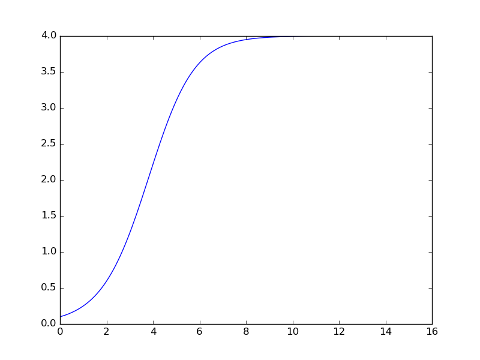
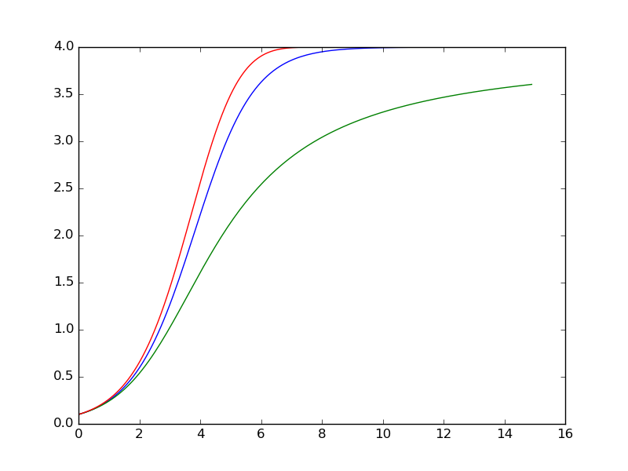
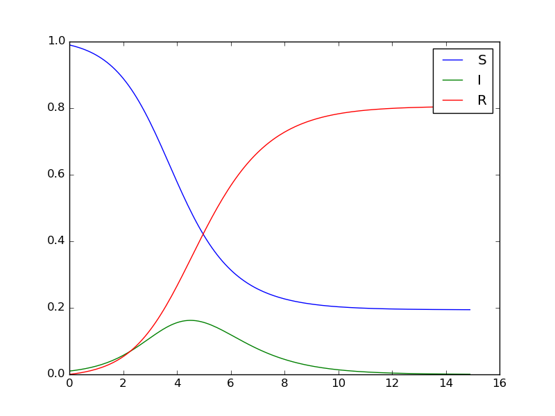
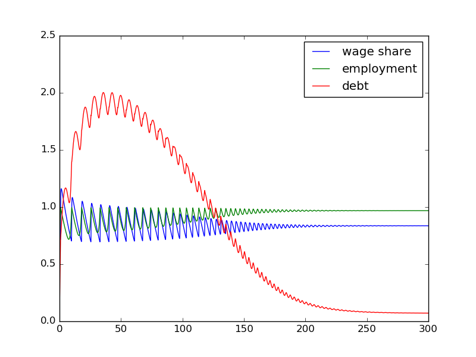

```{r opts,message=FALSE,echo=FALSE,warning=FALSE}
library("knitr")
library("runr")
py <- proc_python()
py$start()
knit_engines$set(python = function(options) {
    knitr:::wrap(py$exec(options$code), options)
})
opts_chunk$set(tidy=FALSE,engine='python',engine.path='python3')
```

## Differential equations

- ubiquitous in applied math, engineering, epidemiology
- modeling continuous-state, continuous-time, non-spatial, deterministic systems
- simple univariate ODEs, e.g. $dN/dt = rN$ or $dN/dt=rN(1-N/K)$
- *systems* of ODEs, e.g. **SIR model**
- solving analytically is deep & complicated, gives general answers
- solving numerically is usually easy (but we only get answers for a particular set of parameters)
- to solve an ODE numerically we need
    - *gradients* ($dx/dt$), specified as a function of current state and time (for *non-autonomous* systems)
	- *initial conditions*
	- time step, length of time to integrate for

## Euler's method

- simplest possible approach
- $N(t+\delta t) = N(t) + \delta t \cdot \frac{dN}{dt}$
- let's solve the logistic equation

```{r logist1}
import numpy as np
import matplotlib.pyplot as plt
## parameters
r=1
K=4
## time info
dt=0.1
t_tot=15
t_vec = np.arange(0,t_tot,step=dt)
x = np.zeros(len(t_vec))
x[0]=0.1  ## initial conditions
for i in range(1,len(t_vec)):
   g = r*x[i-1]*(1-x[i-1]/K)
   x[i] = x[i-1]+g*dt
fig, ax = plt.subplots()
ax.plot(t_vec,x)
fig.savefig("pix/logist1.png")
```



Now let's rewrite it a little more generally:

```{r logist2}
def logist_grad(x,t,params):
    r,K = params  ## unpack parameters
    return(r*x*(1-x/K))

## now run the loop
for i in range(1,len(t_vec)):
    x[i] = x[i-1]+logist_grad(t_vec[i-1],x[i-1],params=(1,4))*dt
```

Now let's rewrite it a general Euler-stepping function:

```{r logist3}
def euler_solve(t_vec,x0,gradfun,params):
   """solve differential equation by Euler's method"""
   x = np.zeros(len(t_vec))
   dt = t_vec[1]-t_vec[0] ## assume evenly spaced ...
   x[0] = x0
   for i in range(1,len(t_vec)):
      x[i] = x[i-1]+gradfun(x[i-1],t_vec[i-1],params=params)*dt
   return(x)

logist_sol = euler_solve(t_vec,x0=0.1,gradfun=logist_grad,params=(1,4))
```

Now we can easily change the model, e.g. try running the *theta-logistic* model:

```{r logist4}
def theta_logist_grad(x,t,params):
   r,K,theta = params
   return(r*x*(1-x/K)**theta)

tlogist_sol1 = euler_solve(t_vec,x0=0.1,gradfun=theta_logist_grad,params=(1,4,2))
## need to make the step length smaller for this one ...
t_vec2 = np.arange(0,t_tot,step=0.001)
tlogist_sol2 = euler_solve(t_vec2,x0=0.1,gradfun=theta_logist_grad,params=(1,4,0.8))

ax.plot(t_vec,tlogist_sol1)
ax.plot(t_vec2,tlogist_sol2)
fig.savefig("pix/logist2.png")
```



What about *systems* of equations?

$$
\begin{split}
\frac{dS}{dt} & = - \beta S I \\
\frac{dI}{dt} & = \phantom{-} \beta S I - \gamma I \\
\frac{dR}{dt} & = \phantom{- \beta S I} + \gamma I
\end{split}
$$

Modifications needed to solve a system of equations:

```{r euler_msolve}
def euler_msolve(t_vec,x0,gradfun,params):
   """solve differential equation by Euler's method"""
   x = np.zeros((len(t_vec),len(x0)))
   dt = t_vec[1]-t_vec[0] ## assume evenly spaced ...
   x[0,:] = x0
   for i in range(1,len(t_vec)):
      x[i,:] = x[i-1,:]+gradfun(x[i-1,:],t_vec[i-1],params=params)*dt
   return(x)
```

Define a gradient function for the SIR model:

```{r SIR_grad}
def SIR_grad(x,t,params):
   beta,gamma = params
   S,I,R = x
   return(np.array([-beta*S*I, beta*S*I-gamma*I, gamma*I]))
```

Solve it:

```{r SIR_sol1}
SIR_sol1 = euler_msolve(t_vec,x0=(0.99,0.01,0),
                        gradfun=SIR_grad,params=(2,1))
```

Plot it:

```{r SIR_plot1}
fig, ax = plt.subplots()
ax.plot(t_vec,SIR_sol1)
ax.legend(("S","I","R"))
fig.savefig("pix/SIR1.png")

```



It's always better not to re-invent the wheel!

```{r scipy}
import scipy.integrate
SIR_sol2 = scipy.integrate.odeint(SIR_grad,
                       y0=(0.99,0.01,0),
                       t=t_vec,
                       args=((2,1),))
```

Results of a more complicated ODE from Grasselli and Costa Lima, "An analysis of the Keen model for credit expansion, asset price bubbles and financial fragility" (Math Finan Econ (2012) 6:191–210 [DOI:10.1007/s11579-012-0071-8](http://dx.doi.org/10.1007/s11579-012-0071-8); [code](../code/grasselli.py)


