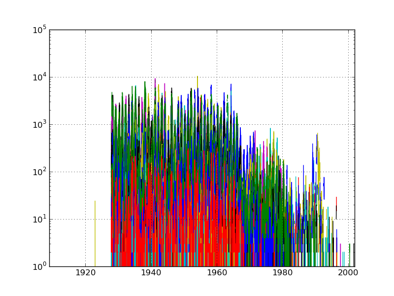
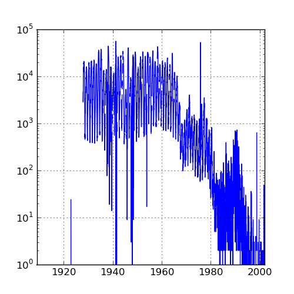
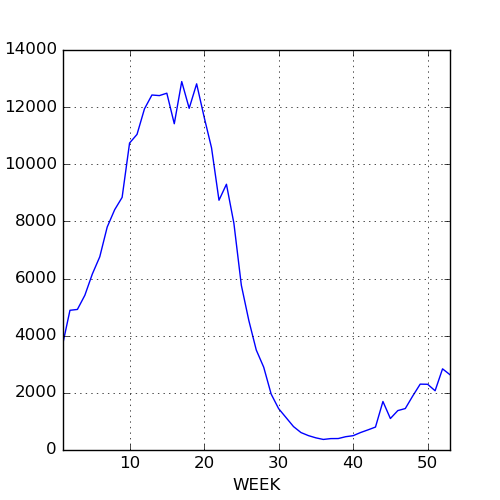

```{r opts,message=FALSE,echo=FALSE,warning=FALSE}
library("knitr")
opts_chunk$set(tidy=FALSE,engine="python",engine.path='python3')
```

* [pandas cheat sheet](https://bit.ly/python_cs)

`pandas` stands for **pan**el **da**ta **s**ystem.  It's a convenient and powerful system for handling large, complicated data sets.

Download US measles data from [Project Tycho](https://www.tycho.pitt.edu/index.php).

```{r do_stuff,echo=FALSE}
import pandas as pd
import matplotlib.pyplot as plt
import numpy as np
v = "MEASLES_Cases_1909-2001_20150322001618.csv"
p  = pd.read_csv(v,skiprows=2,na_values=["-"])  ## read in data
p.index = p["YEAR"]+(p["WEEK"]-1)/52
pp = p.drop(["YEAR","WEEK"],axis=1)             ## drop year/week columns
plt.figure(figsize=(5,5))
pp.plot(legend=False,logy=True)                 ## plot (on log scale)
plt.savefig("pix/measles1.png")
plt.close()
ptot = pp.sum(axis=1)
plt.figure(figsize=(5,5))
ptot.plot(logy=True)
plt.savefig("pix/meastot.png")
plt.close()
plt.figure(figsize=(5,5))
ptotweek = ptot.groupby(p.WEEK)
ptotweekmean = ptotweek.aggregate(np.mean)
ptotweekmean.plot()
plt.savefig("pix/measwk.png")
```

* `read_csv` reads a CSV file as a **data frame**; it automatically interprets the first row as headings
* `df.iloc[]` indexes the result as though it were an array
* `df.head()` shows just at the beginning; `df.tail()` shows just the end

**Data frames**:
* rectangular data structure, a lot like an array.
* can have columns (**Series**) of different types
* can index by labels as well as positions
* handles **missing data**
* convenient plotting
* fast operations with keys

```{r}
import pandas as pd
v = "MEASLES_Cases_1909-2001_20150322001618.csv"
p  = pd.read_csv(v,skiprows=2,na_values=["-"])  ## read in data
print(p.iloc[:,0:3].head())                     ## look at the first little bit
```

## Selecting

* Pandas doc, [indexing and selecting](http://pandas.pydata.org/pandas-docs/dev/indexing.html)
* Choosing specific columns of a data frame
   * `df["NAME"]`: extract one series (column)
   * `df.NAME`  (*attribute* operator)
   * `df.loc[:,"MASSACHUSETTS":"NEVADA"]` (index by *label*; includes endpoint)
   * `df.iloc[:,range]` (index by *integer*)

## Filtering

Choosing specific rows of a data frame; `&`, `|` ,`~` correspond to `and`, `or`, `not`
(individual elements *must* be in parentheses)

```{r eval=FALSE}
ariz = p.ARIZONA                                ## pull out a column (attribute)
ariz[(p.YEAR==1970) & (ariz>50)]                ## *must* use parentheses!
```

## Basic plotting

```{r eval=FALSE}
pp = p.drop(["YEAR","WEEK"],axis=1)     
pp.index = p.YEAR+(p.WEEK-1)/52                 ## assign index
pp.plot(legend=False,logy=True)                 ## plot method (non-Pythonic)
plt.savefig("pix/measles1.png")
```


```{r eval=FALSE}
fig = plt.figure()
ax = fig.add_subplot(1,1,1)
ax.scatter(pp.index,np.log10(pp.ARIZONA))
```

## Column and row manipulations

* totals by week
```{r eval=FALSE}
ptot = pp.sum(axis=1)
```
* `df.min`, `df.max`, `df.mean` all work too ...



## Aggregation

```{r eval=FALSE}
ptotweek = ptot.groupby(p.WEEK)
ptotweekmean = ptotweek.aggregate(np.mean)
ptotweekmean.plot()
```



* early, mid, late periods?
