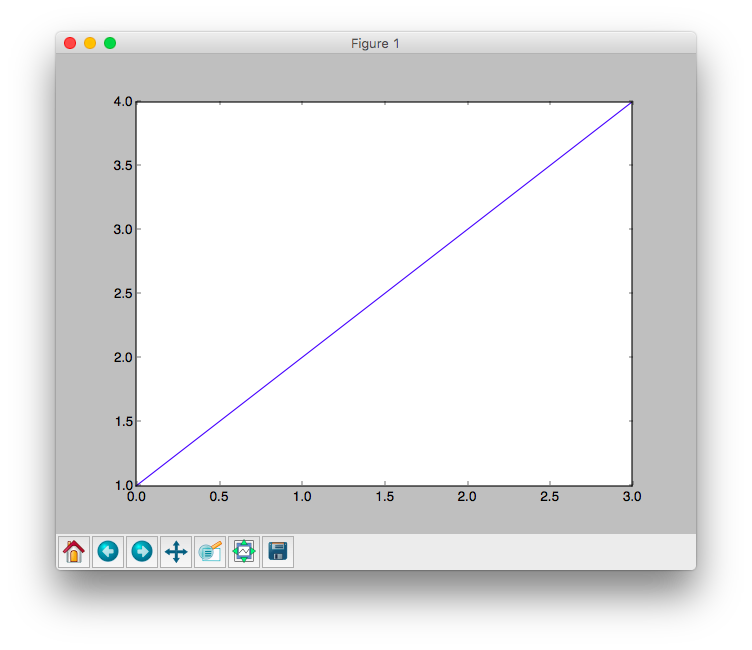
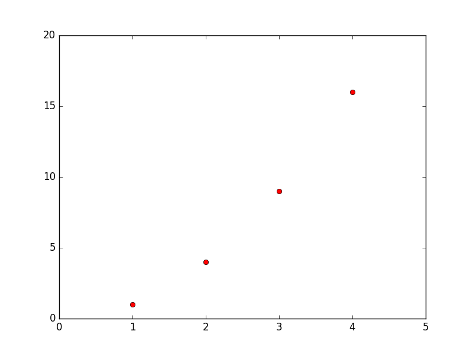
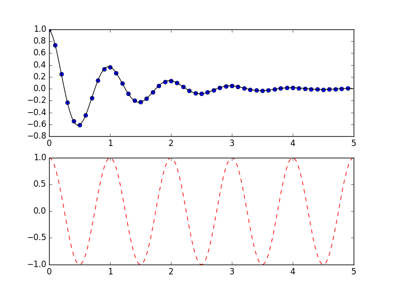
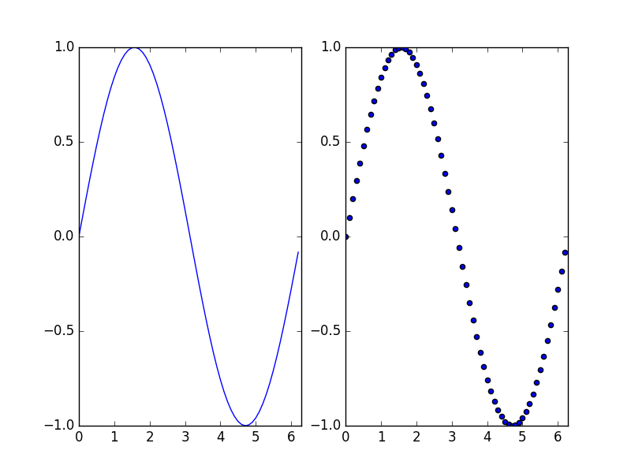

```{r, echo = FALSE, warning = FALSE}
library("knitr")
opts_chunk$set(tidy = FALSE, engine = 'python',engine.path = 'python3')
```

[Documentation reference](http://matplotlib.org/users/pyplot_tutorial.html).


***

## Basic Plotting 

Often when working with data you want to visualize it. The easiest way to do so is with a basic X-Y plot.

```{r}
import matplotlib.pyplot as plt
import numpy as np

nums = np.arange(1,5) 	## numbers from 1 to 4

plt.plot(nums) 			## plot `nums` against itself
plt.show() 				## show plot
```

If `numpy` and `matplotlib` installed correctly, you should see the following window appear:



Normally plotting a vector against itself isn't useful, instead consider plotting a sequence on integers against the squares of the elements:

```{r}
import matplotlib.pyplot as plt
import numpy as np

x = np.arange(1,5) 				## numbers from 1 to 4
y = x**2

plt.plot(x, y ,'ro') 			## plot red circles
plt.axis([0, 5, 0, 20]) 		## set axis bounds to x in [0,6] and y in [0,20]
plt.savefig("tutpix/plot1.png") ## save figure to image file
```

Note the `'ro'` argument specifies that we want to us red (`r`) circles (or o's, `o`), and we set the axis bound manually so we could see the entire plot. This yields the following image `win2.png`:




***

## Multiple plotting

We can also use `plt.plot()` to pot multiple vector combinations at the same time.

```{r}
import numpy as np
import matplotlib.pyplot as plt

t = np.arange(0, 5, 0.2) 								## time from 0 to 5 in steps of 0.2

plt.plot(t, t, 'r--', t, t**2, 'bs', t, t**3, 'g^') 	## plot linear as red dashes,
														## quadratic as blue squares,
														## and cubic as green triangles

plt.savefig("tutpix/plot2.png") 						## save figure to image file
```

Which gives us the image:


***

## Subplotting

We can plot multiple subplots in the same figure. This is useful if we want to compare data or something similar.

```{r}
import matplotlib.pyplot as plt
import numpy as np

def f(t):
    return( np.exp(-t) * np.cos(2*np.pi*t) )

t1 = np.arange(0.0, 5.0, 0.1)
t2 = np.arange(0.0, 5.0, 0.02)

plt.figure(1) 								## select first figure
plt.subplot(2, 1, 1)						## specify 2 rows, 1 column, select 1st subplot
plt.plot(t1, f(t1), 'bo', t2, f(t2), 'k') 	## plot (t1, f(t1)) using blue circles,
											## and (t2, f(t2)) using a black line

plt.subplot(2, 1, 2) 						## specify 2 rows, 1 column, select 2nd subplot
plt.plot(t2, np.cos(2*np.pi*t2), 'r--') 	## plot (t2, cos(2*pi*t2)) with red dashes

plt.savefig("tutpix/plot3.png")				## save figure
```




```{r}
import matplotlib.pyplot as plt
import numpy as np

x = np.arange(0,2*np.pi, 0.1) 				## t in [0, 2*pi]

plt.subplot(1, 2, 1) 						## 1 row, 2 columns, 1st subplot
plt.plot(x, np.sin(x))						## plot (x, sin(x))
plt.axis([0, 2*np.pi, -1, 1]) 				## set axis

plt.subplot(1, 2, 2) 						## 1 row, 2 columns, 2nd subplot
plt.scatter(x, np.sin(x)) 					## scatter plot (x, sin(x))
plt.axis([0, 2*np.pi, -1, 1]) 				## set axis

plt.savefig("tutpix/plot4.png")				## save figure
```

