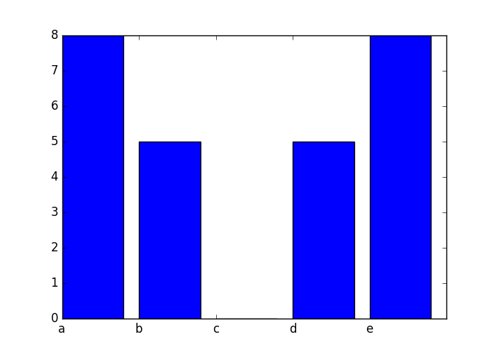

</style>
<!--    content: url(https://i.creativecommons.org/l/by-sa/4.0/88x31.png)
>
<!-- Limit image width and height -->
<style type="text/css">
img {     
  max-height: 560px;     
  max-width: 800px; 
}
</style>

```{r opts,message=FALSE,echo=FALSE}
library("knitr")
knitr::opts_chunk$set(eval=TRUE)
library("reticulate")
use_python("/usr/bin/python3")
```

```{python echo=FALSE}
import matplotlib
matplotlib.use('agg')
```

## matplotlib

- `matplotlib` is the Python module for making graphics and plotting data
- we've already used it, in the `primewalk` example at the beginning of the course
- we will explore some basic capabilities of `matplotlib`, especially the `matplotlib.pyplot` submodule
- resources: [matplotlib cheat sheet](https://bit.ly/python_cs), [gallery](http://matplotlib.org/gallery.html), [tutorial](https://matplotlib.org/tutorials/introductory/pyplot.html)

## basic setup

- if you have Anaconda installed, `matplotlib` should already be installed (for use in Spyder or Jupyter notebooks
- `matplotlib` is already install on syzygy
- once installed, use
```{python}
import matplotlib.pyplot as plt
import numpy as np ## we almost always use matplotlib with numpy
```
- plotting basics ("hello, world" for plots)
```{python}
x = np.arange(5)
plt.plot(x)
```

## showing/saving plots

- if using Spyder (or PyCharm), plots might just show up
- in Jupyter notebooks, put the magic `%matplotlib inline` in a code chunk to display plots
- use `plt.show()` to show plots otherwise
- use `plt.savefig("filename.png")` to save the figure to a file on disk (you can click to open it, or include it in a Word document, or ...)

## basic plots

- a `list`, `tuple`, or 1-D `ndarray` will be treated as the y-axis values for a plot; the indices (0, ... `len(x)-1`) are the x-axis points

```{python}
y = np.array([1,3,2,4,8,5])
plt.plot(y)
plt.show(y)
plt.savefig("example1.png")
plt.close()
```

## more principled plots

- `plt.plot`, `plt.show` are "magic" functions
- better to use `plt.subplots()`
- returns a *tuple* with an object representing the whole **figure** and an object representing the **axes** (plot area)

```{python}
fig, ax = plt.subplots()
ax.plot(y)  ## create plot
fig.savefig("example2.png") ## save figure
```

## scatter plots

- `.scatter()` produces a *scatterplot*
- points instead of lines
- adds a margin around the points

```{python}
fig, ax = plt.subplots()
np.random.seed(101)
x = np.random.randint(5,size=len(y))
ax.scatter(x,y)  ## create plot
```

## Putting more than one thing on a plot

You can put more than one `.plot()` or `.scatter()` on the same set of axes 

```{python}
fig, ax = plt.subplots()
x = np.arange(0,5*np.pi,0.1)
y = np.sin(x)
ax.plot(x,y)
ax.plot(x+np.pi/2,y,color="red")
```

## Modifying plot appearance

- `color`
- `marker` (`+`, `o`, `x`, ...)
- `linewidth`
- `linestyle` (`-`, `--`, `-.`, `None`, ...)

```{python}
fig, ax = plt.subplots()
x = np.arange(0,5*np.pi,0.1)
y = np.sin(x)
ax.plot(x,y,marker="x",linestyle="--",color="purple")
ax.plot(x+np.pi/2,y,linewidth=2,color="blue")
```

## More modifications

Shortcuts for color (first letter), marker, line style ...  see [plot documentation](https://matplotlib.org/api/_as_gen/matplotlib.pyplot.plot.html#matplotlib.pyplot.plot)

```{python}
x = np.arange(0., 5., 0.2)
plt.plot(x, x, "r--")
plt.plot(x, x ** 2, "bs")
plt.plot(x, x ** 3, "g^")
```

## More decorations

- add titles, axis labels ...

- titles (`ax.set_xlabel()`, `ax.set_ylabel()`)
- change limits
- title: `fig.suptitle()` (refers to figure, not individual axes)
- legend: need to specify `label=` for each plot element, e.g.

```{python, results="hide"}
fig, ax = plt.subplots()
x = np.arange(0,5*np.pi,0.1)
y = np.sin(x)
ax.plot(x,y,label="first")
ax.plot(x+np.pi/2,y,color="red",label="second");
ax.set_xlim([0,25])
ax.legend(fontsize=8)
ax.set_xlabel("the x-axis label")
ax.set_ylabel("the y-axis label")
fig.suptitle("my plot")
```

## other plot types

- `matplotlib` can also make bar charts, histograms, and pie
charts
- `plt.bar(cat, values)` produces a bar chart with the items from the list or array `cat` (for "categories") displayed along the x-axis, and above each category, a bar with height equal to `value[i]`, for the i'th category.
- Here's a bar chart with categories `a` through `e` and values given by an array of random integers:

```{python, results="hide"}
fig, ax = plt.subplots()
cat = np.array(["a", "b", "c", "d", "e"])
values = np.random.randint(10, size=5)
x_pos = np.arange(len(values))
ax.set_xticklabels(cat);
ax.bar(x_pos,values);
fig.savefig("bar.png")
```



## histograms

- a **histogram** is a visual representation of the distribution of
continuous numerical data ([Wikipedia](https://en.wikipedia.org/wiki/Histogram))
- it's a bar graph whose categories are intervals that divide some specified range into disjoint bins
- bins are usually (but not always) of equal width
  - each bin shows a bar or rectangle whose height is proportional to the frequency of the numbers falling within that range

```{python, results="hide"}
fig, ax = plt.subplots()
f = open("../data/cherrytree.txt", "r")
height = []
diam = []
for L in f:
    vals = np.array(L.split(),dtype="float")
    diam.append(vals[1])
    height.append(vals[2])
ax.hist(height);
fig.savefig("hist.png")
```


## better bin widths

```{python, results="hide"}
fig, ax = plt.subplots()
ax.hist(height,bins=6);
fig.savefig("hist2.png")
```


## multiple subfigures in a plot

```{python}
fig, ax = plt.subplots(1,3)
fig.set_size_inches((6,3))
ax[0].hist(height,bins=6);
ax[0].set_xlabel("height")
ax[1].hist(diam,bins=6);
ax[1].set_xlabel("diameter")
ax[2].scatter(height,diam)
ax[1].set_xlabel("height")
ax[2].set_xlabel("diameter")
fig.savefig("hist3.png")
```


## The logistic map

- The *discrete logistic map*, $x_{t+1} = r x_t (1-x_t)$, is a simple model for
populations that has interesting dynamical properties.
- It is similar to the continuous *logistic model* $\frac{dx}{dt} = rx(1-x)$, but has very different dynamics when $r$ is large.
- It has equilibria at $0$ and $x^*=1-1/r$. For $r>1$ it mimics exponential
(geometric) growth for $x_t \ll 1$.

## logistic function

- return the sequence of numbers obtained by applying the logistic map repeatedly (`nt` times), starting with `x0` and using the value `r`:

```{python}
def logist_map(r,nt=100,x0=0.5):
   """ run the logistic map """
   x = np.zeros(nt)
   x[0] = x0
   for t in range(1,nt):
      x[t] = r*x[t-1]*(1-x[t-1])
   return(x)
```

---

```{python}
x = logist_map(r=1.5, nt=8)
print(x[:4],"\n",x[4:])
```

---

It's easier if we plot the sequences:

```{python}
fig, ax = plt.subplots()
y1 = logist_map(1.5)
y2 = logist_map(2)
y3 = logist_map(3)
ax.plot(y1)
ax.plot(y2)
ax.plot(y3,'r')
fig.savefig("pix/lm0.png")
```


---

What if we make a function to do this?

---

- The behaviour of the sequence generated by the discrete logistic map depends strongly on $r$
- Let's plot the elements of these sequences for a range of $r$ values.
- In the following, `rvals` is an array of r values ranging from 1.1 to 3.9 in steps of 0.05.
- For the ith value in this array, the ith column of the array `b` will hold the sequence of numbers generated with this `r` value. A scatter plot, with `r` values along the x-axis, and sequence values along the y-axis can be used to visualize the sequences generated for each r value in the array.

```{python bifplot}
rvals = np.arange(1.1,3.9,0.05)
b = np.zeros((500,len(rvals)))
for i in range(len(rvals)):
   b[:,i] = logist_map(r=rvals[i],nt=500)
```

---

- `np.tile(x,s)` takes  a vector and replicates it a number of times specified by the tuple `s`

```{python lm1}
fig, ax = plt.subplots()
rmat = np.tile(rvals,(500,1))
ax.scatter(rmat,b)
fig.savefig("pix/lm1.png")
```


## now without the transient

```{python lm2}
fig,ax = plt.subplots()
b2 = b[250:,]
rmat2 = np.tile(rvals,(250,1))
ax.scatter(rmat2,b2)
fig.savefig("pix/lm2.png")
```


## now as an image plot

```{python lm3}
fig,ax = plt.subplots()
ax.imshow(b2,aspect="auto",extent=[1.1,3.9,250,500],interpolation="none")
fig.savefig("pix/lm3.png")
```


