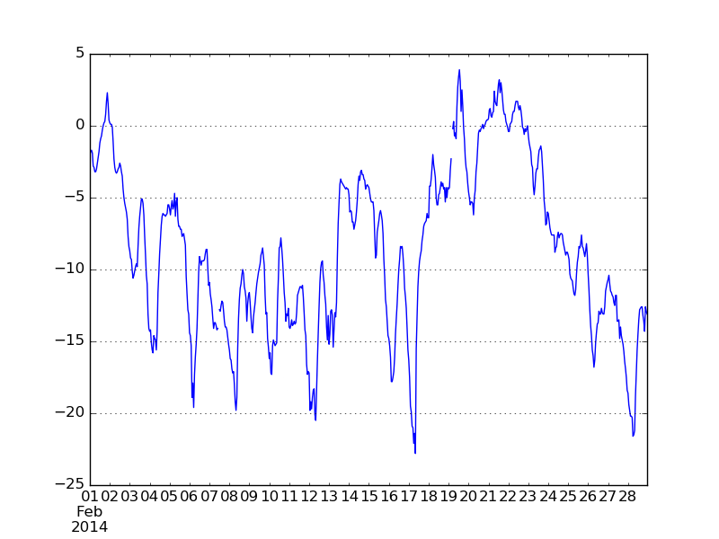
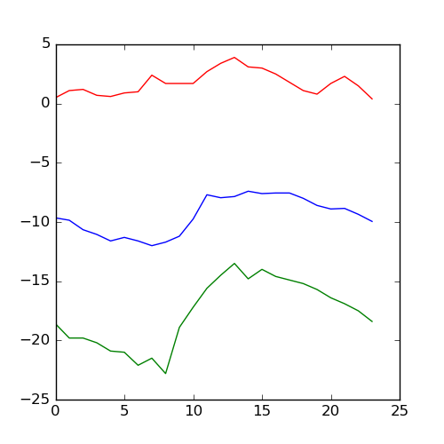

</style>
<!--    content: url(https://i.creativecommons.org/l/by-sa/4.0/88x31.png)
>
<!-- Limit image width and height -->
<style type="text/css">
img {     
  max-height: 560px;     
  max-width: 800px; 
}
</style>

```{r opts,message=FALSE,echo=FALSE}
library("knitr")
knitr::opts_chunk$set(eval=TRUE)
library("reticulate")
use_virtualenv("~/.virtualenvs/env", require=TRUE) ## careful with this!
```

## generating errors

- we've already seen the `raise` keyword, in passing
- `raise Exception` is the simplest way to have your program stop when something goes wrong
- in a notebook/console environment, it stops the current cell/function (doesn't crash the session)

---

```{python r1, eval=FALSE}
raise Exception
```

```
Traceback (most recent call last):
  File "<stdin>", line 1, in <module>
Exception
```

---

- you have to `raise <something>`
- `Exception` is the most general case ("something happened")
- other possibilities
    - `TypeError`: some variable is the wrong type
	- `ValueError`: some variable is the right type but the wrong value
	
---

```{python typeerror1, eval=FALSE}
x = -1
if not isinstance(x,str): ## check if x is a str
    raise TypeError
```

```
Traceback (most recent call last):
  File "<stdin>", line 2, in <module>
TypeError
```

---

```{python valerror1, eval=FALSE}
import math
x = -1
if x<0:
    raise ValueError
print(math.sqrt(x))
```

```
Traceback (most recent call last):
  File "<stdin>", line 2, in <module>
ValueError
```

```{python importmath,echo=FALSE}
import math
```

## error messages

- it's always better to be more specific about the cause of an error:

```{python typeerror2,eval=FALSE}
x = -1
if not isinstance(x,str): ## check if x is a str
    errstr = "x is of type "+type(x).__name__+", should be str"
    raise TypeError(errstr)
```

```
TypeError: x is of type int, should be str
```

**f-strings** are a convenient way to construct error messages: anything inside curly brackets is interpreted as a Python expression. e.g. 

```{python fstr}
x=1
print(f"x is of type {type(x).__name__}, should be str")
```

So we could use

```{python fstr2,eval=FALSE}
if not isinstance(x,str): ## check if x is a str
    raise TypeError("x is of type {type(x).__name__}, should be str")
```

```{python valerror2,eval=FALSE}
x = -1
if x<0:
    raise ValueError(f"x should be non-negative, but it equals {x}")
```
```
ValueError: x should be non-negative, but it equals -1
```

## warnings

An error means "it's impossible to continue" or "you shouldn't continue without fixing the problem". You might want to issue a *warning* instead. This is not too different from just using `print()`, but it allows advanced users to decide if they want to suppress warnings.

```{python warn0}
import warnings
```

```{python warn1}
warnings.warn("something bad happened")
```

## handling errors

Now suppose you are getting an error and you don't want your program to stop. "Wrapping" your code in a `try:` clause will allow you to specify what to do in this case.  `pass` is a special Python statement called a "null operation" or a "no-op"; it does nothing except keep going.

```{python trypass}
try:
    x= math.sqrt(-1)
except:
    pass
## keep going (but x will not be set)
```

You can specify something you want to do with only a particular set of errors:

```{python trypass2}
try:
    x = math.sqrt(-1)
except ValueError: 
    print("a ValueError occurred")
except:
    print("some other error occurred")
## keep going (but x will not be set)
```

If the error isn't caught because it isn't the right type, it will act like it normally does (without the `try:`)

```{python except0,eval=FALSE}
try:
    z += 5  ## not defined yet
except ValueError: 
    print("a ValueError occurred")
```
```
NameError: name 'z' is not defined
```

We could catch this with a general-purpose `except:`

```{python except1}
try:
    z += 5  ## not defined yet
except ValueError: 
    print("a ValueError occurred")
except:
    print("some other error occurred")
```

Or add another clause to catch it:

```{python except2}
try:
    z += 5  ## not defined yet
except ValueError: 
    print("a ValueError occurred")
except NameError:
    print("a NameError occurred")
except:
    print("some other error occurred")
```

## general rules

- see if you can change your code to avoid getting errors in the first place
- catch specific errors 
- do something sensible with errors (e.g. convert to warnings, return `nan` ...)

```{python nan}
try:
    x = math.sqrt(-1)
except ValueError: 
    x = math.nan
print(x)
```


# pandas

## definition and reference
- `pandas` stands for **pan**el **da**ta **s**ystem.  It's a convenient and powerful system for handling large, complicated data sets. (The author [pronounces it "pan-duss"](https://twitter.com/wesmckinn/status/706661972431892483?lang=en).)
- [pandas cheat sheet](https://github.com/pandas-dev/pandas/blob/master/doc/cheatsheet/Pandas_Cheat_Sheet.pdf)

## Data frames 

- rectangular data structure, looks a lot like an array.
- each column is a **Series**; each column can be of a different type
- rows and columns act differently
- can index by (column) labels as well as positions
- handles **missing data** (`NaN`)
- convenient plotting
- fast operations with keys
- lots of facilities for input/output

```{python basic}
import pandas as pd  ## standard abbreviation
# The initial set of baby names and birth rates
names = ['Bob','Jessica','Mary','John','Mel']
births = [968, 155, 77, 578, 973]
## initialize DataFrame with a *dictionary*
p = pd.DataFrame({'Name': names, 'Count': births})
print(p)
```

What can we do with it?

- "Simple" indexing
    - *Indexing* (a single value) selects a column by its *key*
	- key could be a number, if column names weren't given when setting up the data frame
	- *Slicing* selects *rows* by number
	- indexing with a *list* gives multiple columns
	- `.iloc` gives row/column indices (like an array)

```{python indexing,eval=FALSE}
p["Count"]  ## extract a column = Series (by *name*)
p[2:3]      ## slice one row (3-2 = 1)
p[2:5]      ## slice multiple rows
p[["Name","Count"]]    ## extract multiple columns (data frame)
p.iloc[1,1]     ## index with row/column integers like an array
p.iloc[0:5,:]   ## can also slice
```

Indexing by name
```{python name_indexing,eval=FALSE}
p["Name"][4]  ## 5th element of Name
p.Name  ## attribute!
p.loc[1:2,"Name"]  ## index by *label*, _inclusive_
```

## Measles data

Download US measles data from [Project Tycho](https://www.tycho.pitt.edu/index.php).

<!-- should use a makefile with pandas_weather.py and pandas_measles.py -->

- `read_csv` reads a CSV file as a **data frame**; it automatically interprets the first row as headings
- `df.iloc[]` indexes the result as though it were an array
- `df.head()` shows just at the beginning; `df.tail()` shows just the end

Let's look at the first few rows of a data set on measles in US states:

```{python print_measles,echo=FALSE}
fn = "../data/MEASLES_Cases_1909-2001_20150322001618.csv"
f = open(fn,"r")
s = f.readlines()[:6]
x = [print(x[:70]+"...") for x in s] ## don't display
```

```{python get_measles}
fn = "../data/MEASLES_Cases_1909-2001_20150322001618.csv"
p  = pd.read_csv(fn,skiprows=2,na_values=["-"])  ## read in data
p.head()                     ## look at the first little bit
```

Mostly `NaN` values at the beginning! (`NaN` = "not a number": similar to `nan` from `math` or `numpy`)

## Selecting

- Like `numpy` array indexing, but a little different ...
- Pandas doc, [indexing and selecting](http://pandas.pydata.org/pandas-docs/dev/indexing.html)
   * extract by name: `df.loc[:,"MASSACHUSETTS":"NEVADA"]` (index by *label*; **includes endpoint**)
   * extract by integer index: `iloc` method, `df.iloc[:,range]` (index by *integer*; **doesn't include endpoint**)
```{python select1}
p.loc[:,"MASSACHUSETTS":"NEVADA"]
```

This is the same:

```{python select2}
pc = list(p.columns) ## list of colum names
print(pc[:5])
## find the locations of these two state names
mass_ind = list(pc).index("MASSACHUSETTS")
neva_ind = list(pc).index("NEVADA")
## index using `.iloc` (with extended range)
p.iloc[:,mass_ind:neva_ind+1]
```

## More examples

You can also refer to *individual* columns as **attributes** (i.e. just `p.<name>`)

```{python head}
p.ARIZONA[:5]
p.ARIZONA.head()
```

`.drop()` gets rid of elements

```{python drop}
pp = p.drop(["YEAR","WEEK"],axis=1)
## equivalent to
pp2 = p.iloc[2:,]
pp3 = p.loc[:,"ARIZONA"]
```

Always use name-indexing whenever you can!

`.index` is a special attribute of data frames that governs searching, plotting, etc.. Here we'll set it to a decimal date value:

```{python}
pp.index = p.YEAR+(p.WEEK-1)/52
```

## Filtering

Choosing specific rows of a data frame; `&`, `|` ,`~` correspond to `and`, `or`, `not`
(individual elements *must* be in parentheses)

```{python arizona}
ariz = p.ARIZONA                                ## pull out a column (attribute)
ariz[(p.YEAR==1970) & (ariz>50)]                ## *must* use parentheses!
```

## Basic plotting

`pandas` will automatically plot data frames in a (reasonably) sensible way
```{python plot}
import matplotlib.pyplot as plt
fig, ax = plt.subplots()
## pp.plot()
pp.plot(legend=False,logy=True)                 ## plot method (non-Pythonic)
plt.savefig("pix/measles1.png")
```


Or we can create our own (less complex) plots
```{python simple_plot}
import numpy as np
fig = plt.figure()
ax = fig.add_subplot(1,1,1)
ax.scatter(pp.index,np.log10(pp.ARIZONA))
```

## Column and row manipulations

- totals by week
```{python row_totals}
ptot = pp.sum(axis=1)
```
- `df.min`, `df.max`, `df.mean` all work too ...


## Aggregation

```{python agg1}
ptotweek = ptot.groupby(p.WEEK)
ptotweekmean = ptotweek.aggregate(np.mean)
ptotweekmean.plot()
```


## Dates and times

[reference](https://docs.python.org/3.0/library/datetime.html)

- (Another) complex subject. 
- Lots of [possible date formats](https://xkcd.com/1179/)
- Basic idea: something like `%Y-%m-%d`; separators just match whatever's in your data
(usually "/" or "-"). Results need to be unambiguous, and ambiguity is dangerous
(how is day of month specified?  lower case, capital? etc.)
- `pandas` tries to guess, but you shouldn't let it.
```{python datetime}
print(pd.to_datetime("05-01-2004"))
print(pd.to_datetime("05-01-2004",format="%m-%d-%Y"))
```
- Time zones and daylight savings time can be a nightmare
- May need to have the right number of digits, especially in the absence of separators:
```{python}
import pandas as pd
print(pd.to_datetime("1212004",format="%m%d%Y"))
print(pd.to_datetime("12012004",format="%m%d%Y"))
```

For our measles data we have week of year, so things get a little complicated
```{python weekdate}
yearstr = p.YEAR.apply(format)
weekstr = p.WEEK.apply(format,args=["02"])
datestr = p.YEAR.astype(str)+"-"+weekstr+"-0"
dateindex = pd.to_datetime(datestr,format="%Y-%U-%w")
```

## Binning results

- turn a quantitative variable into categories
- `pd.cut(x,bins=...)`; decide on bins
- `pd.qcut(x,n)`; decide on number of bins (equal occupancy)

## Weather data

```{python weather1}
## fancy stuff: automatically look for index and convert it to a date/time
p = pd.read_csv("../data/eng2.csv",skiprows=14,encoding="latin1",index_col="Date/Time",parse_dates=True)
## rename columns
p.columns = [
    'Year', 'Month', 'Day', 'Time', 'Data Quality', 'Temp (C)', 
    'Temp Flag', 'Dew Point Temp (C)', 'Dew Point Temp Flag', 
    'Rel Hum (%)', 'Rel Hum Flag', 'Wind Dir (10s deg)', 'Wind Dir Flag', 
    'Wind Spd (km/h)', 'Wind Spd Flag', 'Visibility (km)', 'Visibility Flag',
    'Stn Press (kPa)', 'Stn Press Flag', 'Hmdx', 'Hmdx Flag', 'Wind Chill', 
    'Wind Chill Flag', 'Weather']
## drop columns that are *all* NA
p = p.dropna(axis=1,how='all')
p["Temp (C)"].plot()
## get rid of columns (axis=1) we don't want
p = p.drop(['Year', 'Month', 'Day', 'Time', 'Data Quality'], axis=1)
```


Now pull out the temperature and take the median by hour:
```{python hourmedian}
temp = p[['Temp (C)']]
temp["Hour"] = temp.index.hour
temphr = temp.groupby('Hour')
medtmp = temphr.aggregate(np.median)
maxtmp = temphr.aggregate(np.max)
mintmp = temphr.aggregate(np.min)
```
Now plot these ...



