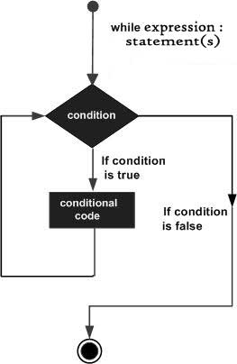
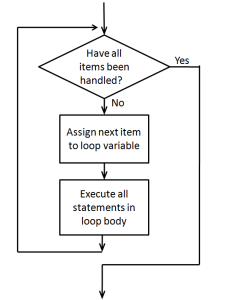

</style>
<!--    content: url(https://i.creativecommons.org/l/by-sa/4.0/88x31.png)
>
<!-- Limit image width and height -->
<style type="text/css">
img {     
  max-height: 560px;     
  max-width: 800px; 
}
</style>

```{r opts,message=FALSE,echo=FALSE}
library("knitr")
library("reticulate")
use_python("/usr/bin/python3")
```

# Lists and indexing (PP chapter 8)

*reference*: [Python intro](https://docs.python.org/3/tutorial/introduction.html) section 3.1.3

## Lists

- Use square brackets `[]` to set up a **list**
- Lists can contain anything but usually homogeneous
- Put other variables into lists
- `range()` makes a **range** but you can turn it into a list with `list()`
     - *Set up a list that runs from 101 to 200*
- Indexing and slicing lists works almost the same way as indexing and slicing ...
- Put lists into lists! ("yo dawg ...")
     - difference between an *item from a list* (indexing, `x[0]`) and a *one-element list* (slicing, `x[0:1]`)

---


## Other list operations

- Lots of things you can do with lists!
- Lists are **mutable**
```{python list_mut}
x = [1,2,3]
y = x
y[2] = 17
print(x)
```

Check it out at [Python Tutor](http://pythontutor.com/visualize.html#mode=edit)

- *operators* vs. *functions* vs. *methods* `x+y` vs. `foo(x,y)` vs. `x.foo(y)`
    * list [*methods*](http://www.linuxtopia.org/online_books/programming_books/python_programming/python_ch14s07.html)
    * appending and extending:
```{python append}
x = [1,2,3]
y = [4,5]
x.append(y)
print(x)
```
```{python extend}
x = [1,2,3] # reset x
y = [4,5]
x.extend(y)
print(x)
```
Can use `+` and `+=` as shortcut for extending:
```{python operate}
x = [1,2,3]
y = [4,5]
z = x+y
print(z)
```

## list methods

- `x.insert(position,value)`: inserts (or `x=x[0:position]+[value]+x[position+1:len(x)]`)
- `x.remove(value)`: removes *first* value
- `x.pop(position)` (or `del x[position]` or `x=x[0:position]+x[position+1:len(x)]`)
- `x.reverse()` (or `x[::-1]`)
- `x.sort()`: what it says
- `x.count(value)`: number of occurrences of `value`
- `x.index(value)`: first occurrence of `value` 
- `value in x`: does `value` occur in `x`? (or `logical(x.count(value)==0)`)
- `len(x)`: length

**Note**: [pythonicity](http://blog.startifact.com/posts/older/what-is-pythonic.html) vs. [TMTOWTDI](http://en.wikipedia.org/wiki/There%27s_more_than_one_way_to_do_it)

# Conditionals and flow control

- **Conditionals**: Do something *if* something else is true
- **Flow control**: Go to different places in the code: especially, repeat calculations
- Everything we need for interesting programs (["the rest is commentary"](http://en.wikipedia.org/wiki/Hillel_the_Elder))
- Technically we can compute *anything*: [Turing machines](http://en.wikipedia.org/wiki/Turing_machine) ([xkcd](http://xkcd.com/205/))

## Conditionals

- Do something *if* something is true
- `if` statement ([reference](https://docs.python.org/3/tutorial/controlflow.html))
```{python if1}
if False:
    print("no")
```
- else-if (`elif`) and `else` [clauses](http://xkcd.com/764/)
```{python if2,eval=FALSE}
if (x<=0):
    print("what??")
elif(x==1):
    print("one")
elif(x==2):
    print("two")
else:
    print("many")
```
- not too much else to say
- we can do more than one thing; use a *code block*
- indentation is crucial

## codingbat examples

- [CodingBat date_fashion problem](http://codingbat.com/prob/p129125)
- [CodingBat alarm clock problem](http://codingbat.com/prob/p119867)

## while 

- repeat code many times, *while* some logical statement is true
([reference](https://docs.python.org/3/reference/compound_stmts.html#while))

For example:
{width=2in}
```{python while1}
x = 17
while x>1:
    x = x/2
```

Maybe we want to know how many steps that took:
```{python while1B}
x = 17
n = 0
while x>1:
    x = x/2
    n = n+1
```

- **What is the answer?**
- Can you get the same answer using `import math` and `math.log(x,2)` (and maybe `round()` or `math.floor`)?

- We can use logical operators to combine

```{python while1C}
x = 17
n = 0
while x>1 and n<3:
    x = x/2
    n = n+1
```

## for loops

- what if we want to repeat a fixed number of times?  We could use something like

```{python while2,eval=FALSE}
n = 0
while n<n_max:
    # do stuff
    n = n+1
```

Or we could use a `for` loop:

```{python for1,eval=FALSE}
for n in range(0,n_max):
    # do stuff
```

- does this repeat `n_max` or `n_max+1` times? (hint: try it out, and/or use `list(range(...))` ...)

- more generally, we can use `for` to iterate over *any list*.

{width=2in}

## `for` loop examples

- [CodingBat > string-2 > countHi](https://codingbat.com/prob/p167246)
- [CodingBat > string-2 > catDog](https://codingbat.com/prob/p164876)
- [CodingBat > Array-2 > bigDiff](http://codingbat.com/prob/p196640)

Another example: a change-writing program.

*Given an amount of money, return a list of length 5 that gives the (smallest) number of coins of each unit (toonies, loonies, quarters, dimes, and nickels) required to make up that amount.*

```{python intdiv}
total=5.73
toonies = 5.73 // 2 ## integer division
total = total - 2*toonies
```
```{python change,eval=FALSE}
total = 5.73
res = []   # empty list
denoms = list(2,1,0.25,0.1,0.05)
for d in denoms:
    # do stuff
```

- start with `total`, use `denoms` above

1. program to see how many pennies are left (how could we do this much more easily?)
2. **or** print out change as we go along
3. **or** save results as an array


Now let's look at the [prime walk program](../code/primewalk.py) again ...

## More CodingBat examples:

- List-2 > count_evens
- List-2 >sum13
- List-2 > bigdiff
- reverse a list (not using slicing)?

## `break`

`break` is a way to get out of a `while` or `for` loop early:

```{python pyloop_break, eval=FALSE}
for i in range(0,10):
   if i>5:
      break
```

## nested `for` loops

We can look at (e.g.) all the combinations of `i` and `j` via:

```{python py_nested_loop, eval=FALSE}
for i in range(0,3):
   for j in range(0,3):
      print([i,j])
```

## Loops and indices

From [Secret Weblog](http://blog.startifact.com/posts/older/what-is-pythonic.html): all of the following are equivalent ...

```{python pyloop1,eval=FALSE}
i = 0
while i < mylist_length:
   do_something(mylist[i])
   i += 1  ## or i=i+1
```

vs.

```{python pyloop2,eval=FALSE}
for i in range(mylist_length):
   do_something(mylist[i])
```

(this form is useful if we need to combine two lists, or otherwise index element `i` of several different things ...)

vs.

```{python pyloop3,eval=FALSE}
for element in mylist:
   do_something(element)
```

## Criteria

- speed 
- memory use
- simplicity (code length)
- simplicity (avoid modules)
- simplicity (avoid abstractions)
- pythonicity
