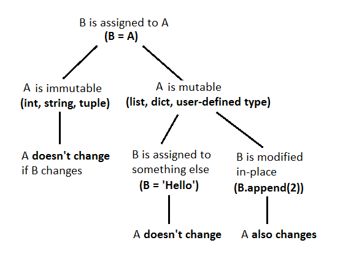

</style>
<!--    content: url(https://i.creativecommons.org/l/by-sa/4.0/88x31.png)
>
<!-- Limit image width and height -->
<style type="text/css">
img {     
  max-height: 560px;     
  max-width: 800px; 
}
</style>

```{r opts,message=FALSE,echo=FALSE}
library("knitr")
library("reticulate")
use_python("/usr/bin/python3")
```

## Functions

Reference: [Python tutorial section 4.6](https://docs.python.org/3/tutorial/controlflow.html#default-argument-values)

- *the* most important tool for structuring programs
- allows *modularity*
- basic definition: `def function_name(args):` plus indented code block
- inputs are called **arguments**. outputs are called **return values**
- when function is called, go to the function, with the arguments, run code until you hit `return()` (return `None` if you get to the end without a `return`)

## Return values

- most functions return values
- might not ... *side effects*
	* input/output (create a plot, write output to a file, turn on a machine, ...)
    * changing a (mutable!) variable


## Function arguments

- basic arguments: *unnamed*, *mandatory*
- think of them as dummy variables; could be the same or different from the name in the calling environment

## examples (try in Python tutor)

```{python add_one}
def add_one(x):
    x = x+1
    return(x)
x = 2
print("add_one=",add_one(x),", x=",x)
```

```{python add_one_again}
z = 2
print("add_one=",add_one(x),", x=",x)
```

`z` is **immutable** (a number), so it doesn't change; if you want it to change, use `z=add_one(z)`

## mutability and functions 

Changes within functions follow the standard mutability rules:



Compare:

```{python no_return}
def no_return(x):
    x = [2,3,4]
    return(None)

z = [1,2,3]
no_return(z)
z
```

With:

```{python no_return2}
def no_return(x):
    x[0] = 7
    return(None)

z = [1,2,3]
no_return(z)
z
```

## optional arguments

- give *default* values
- for user convenience
- e.g. logarithm: `def log(value,math.e)`

## Docstrings

- always say something about what your function does. (Feel free to give me a hard time in class if I don't.)

```{python docstrings}
def documented_function():
    """this is a function that does
       nothing very useful
    """
    return(None)
```

## Example

```{python doc_ex}
def add_function(a, b):
    """ the sum of two numbers
    Parameters
    ----------
    a : num
    b : num
    Returns
    -------
    sum : num
    The sum of a and b
    Examples
    --------
    >>> add_function(2, 5)
    7
    >>> add_function(3, -1.4)
    1.6
    """
    sum = a + b
    return sum
```

## retrieving docstring

```{python doc_ex_print}
print(add_function.__doc__)
```

# Errors

## Example code to work with


## Types of errors

* **syntax errors** vs. **logic errors**

* a working [matrix sum function](code/sum_matrix_good.py)
* failure modes from logic errors:
    * obvious failure
        * program stops with an error partway through: [bad matrix sum #0](../code/sum_matrix_noinit.py)
        * Python crashes
        * machine crashes
		* program never stops (infinite loop)
    * wrong answer
	    * always vs. sometimes (obvious categories) vs. sometimes (mysterious)
		* obvious vs. subtle

--- 

Next section follows [this presentation](http://space.wccnet.edu/~pmillis/cps120/presentations/program_logic_errs.ppt)

-  infinite loops:

What's wrong with this code? (It's meant to loop until the user enters either "y" or "n" ...)

```{python infloop,eval=FALSE}
print("Please enter (y)es or (n)o")
cin = input()
while ((response != "y") or (response != "n")):
   print("Please try again")
```

or (`not response in "yn"`)

[bad matrix #1](../code/sum_matrix_infloop.py)
 
- operator precedence mistakes, e.g. $\Delta \textrm{fahrenheit} = \Delta \textrm{Celsius} \times 1.8$
```{python FCconv,eval=FALSE}
fahrdiff = celsius_high - celsius_low * 1.8
```

- off-by-one error ("fencepost problem")
   -  ... more generally, **edge** or **corner cases**
* code incorrectly inside/outside loops: 
   * [bad matrix #2](../code/sum_matrix_bad2.py)
   * [bad matrix #3](../code/sum_matrix_bad3.py)
* array index error (outside bounds)

## Error messages

* error messages are *trying* to tell you something
* Google error messages (with quotation marks)

## Debugging

- *brute-force logic* ("Feynman method"): stare at your code, try to figure out what's wrong  
(test cases: why is it failing in one specific situation?)
- flow charts, *pseudocode*
- tracing (`print()` statements)
    - put print statements before and after `if` conditions
	- before and after loops
	- in places where you suspect something might go wrong
- interactive tracing
- debugging tools (breakpoints/watchpoints/watches)


## Searching for/asking for help

## Searching for help

* Google (or your search engine of choice)
* be as specific as possible

## Asking for help

* reproducible/minimal workable examples
    * right amount of context
	* "how to ask" ([StackOverflow](http://stackoverflow.com/help/how-to-ask))
* browse/lurk in forums first!
* tone
* where:
    * forums
    * StackOverflow

## Testing

* Simplify, simplify, simplify
* Reduce the size of your problem
* Cases with easy/known answers
* "corner" & "edge" cases
* Random tests ([fuzz testing](http://en.wikipedia.org/wiki/Fuzz_testing))
* Automatic testing framework: `nose`
    * built-in Python package
	* define test file
	    * basic: `assert <condition>`
	    * extra: `from nose.tools import assert_equal, assert_raises` (or something)
		* (generating an error: `raise ErrorType("message")`, e.g. `raise ValueError("non-conformable matrices")`
		* each test or set of tests as a separate function
		* see [test_mm.py](../code/test_mm.py)
	* `nosetests`/run in PyCharm
* Test-driven development: write tests **first**!	

## Additional resources

* http://stackoverflow.com/questions/1623039/python-debugging-tips
* https://www.udacity.com/course/cs259
* http://www.cs.yale.edu/homes/aspnes/pinewiki/C%282f%29Debugging.html
* http://www.cs.cf.ac.uk/Dave/PERL/node149.html


