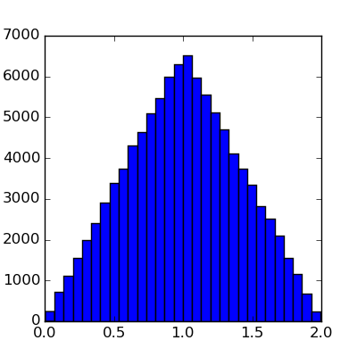

```{r opts,message=FALSE,echo=FALSE,warning=FALSE}
library("knitr")
opts_chunk$set(tidy=FALSE,engine="python",engine.path='python3')
```

## Corrections

## Integration

* How should we integrate $\int_0^1 \sqrt{1-x^2} \, dx$?
```{r echo=FALSE}
import matplotlib.pyplot as plt
import numpy as np
x = np.linspace(0,1,101)
y = np.sqrt(1-x**2)
plt.figure(figsize=(4,4))
plt.plot(x,y)
plt.savefig("pix/qtrcirc.png")
```


* What about something horrible like $\int_0^1 \exp(-x^2) \log(1+x) \, dx$ ?
* Let's write a couple of programs:
    * brute force (without array functions, only `for` loops)
	* with array functions (we shouldn't need any `for` loops)
* How could we make this better?
    * better integration rules (trapezoid, Simpson's?)
    * choice of `n`
	* adaptive integration (i.e., choice of tolerance): loops within loops ...
* Hard things
    * high dimensions
	* weird shapes/limits of integration

## (Pseudo)random numbers

* From [Wikipedia](http://en.wikipedia.org/wiki/Pseudorandom_number_generator): "Anyone who considers arithmetical methods of producing random digits is, of course, in a state of sin" (von Neumann) ([original paper](https://dornsifecms.usc.edu/assets/sites/520/docs/VonNeumann-ams12p36-38.pdf)) ... "We are here dealing with mere 'cooking recipes' for making digits; probably they can not be justified, but should merely be judged by their results ..."
* *linear congruential generators*:
    * $x_n = (a x_{n-1} + c) \textrm{mod} m$
	* or `x = (a*x +c ) % m`
	* from [here](http://www.eternallyconfuzzled.com/tuts/algorithms/jsw_tut_rand.aspx):
```{r}
x = [5]
(a,c,m) = (2,3,10)
for i in range(9):
    newx = (a*x[-1]+c) % m
    x.append(newx)
print(x)
```
* Park-Miller *minimal standard generator*:
```{r}
import numpy as np
(a,c,m) = (16807,0,2147483647)
x = [5]
for i in range(9):
    newx = (a*x[-1]+c) % m
    x.append(newx)
print(np.array(x)/m)
```

```{r echo=FALSE}
import numpy as np
import matplotlib.pyplot as plt
(a,c,m) = (16807,0,2147483647)
x = [5]
for i in range(1000):
    newx = (a*x[-1]+c) % m
    x.append(newx)
a = np.array(x)/m
plt.figure(figsize=(4,4))
plt.plot(a)
plt.savefig("pix/ran1.png")
```


* using `numpy`: [reference](http://docs.scipy.org/doc/numpy/reference/routines.random.html)
```{r}
import numpy.random as rand
a = rand.rand(1000)
```
* can also do useful things like
   * pick from a list: `choice()` (with or without replacement)
   * shuffle values: `shuffle()` (in-place)
   * pick values from different distributions
   * sample from a large range of non-uniform distributions (Poisson, Normal, binomial ...)
* using random number generators for serious work:
   * know what generator is used (Mersenne twister is OK)
   * set the seed: `seed()`
* using random numbers for cryptography: be super-paranoid: see e.g. [this](http://stackoverflow.com/questions/20936993/how-can-i-create-a-random-number-that-is-cryptographically-secure-in-python)

## Monte Carlo integration

* *Monte Carlo* techniques (Ulam)
* Monte Carlo integration
    * pick uniform numbers in a simple region (e.g. square)
	* what fraction fall under the curve?
    * also called *rejection sampling* in this context
* let's write the program

## Convolutions (sums of random variables)

* What is the distribution of the *sum* of two (independent) random variables?
* e.g. what is the distribution of the sum of two uniform variables?
* we can do this by integration: the probability (density) that $X+Y=Z$?  It's
$$
\int p(Y=r) \cdot p(X=Z-r) \, dr
$$
This is called a *convolution*, sometimes notated as $p_Z = (p_X * p_Y)$.
* Can sometimes do this analytically.
* Or can do it numerically. What should the limits be?
* Write a function to do this integral (`def convolve(px,py,a,b,n)`)?
* Or we can get the distribution by random sampling:
```{r convolve}
import matplotlib.pyplot as plt
import numpy as np
import numpy.random as rand
rand.seed(101)
x = rand.rand(100000)
y = rand.rand(100000)
z = x+y
plt.figure(figsize=(4,4))
plt.hist(z,bins=30)
plt.savefig("pix/hist.png")
```


## The delta method

* to be continued ...

## Integrating ODEs

* Euler's method
* to be continued ...
